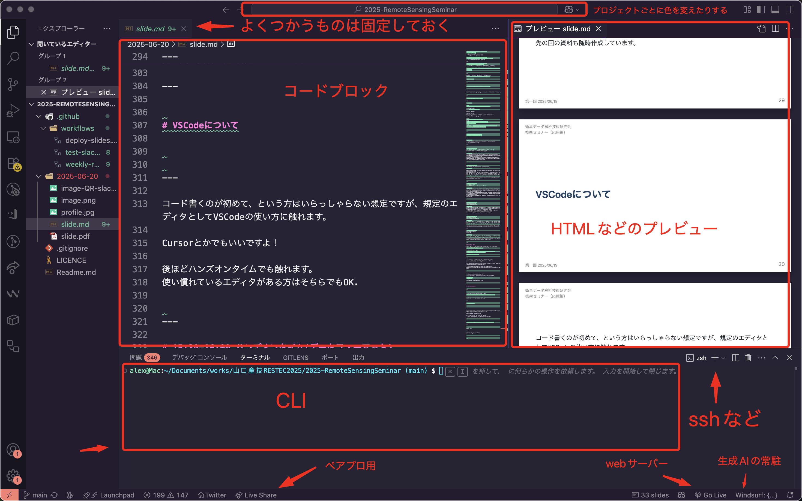

# 衛星データ解析技術研究会 技術セミナー（応用編）
## Webアプリケーションの開発技術の習得

第一回 2025/06/20

担当講師 : 田中聡至

---

## 本日のテーマ

1. オリエンテーション
1. 昨年度研究会の内容を振り返る 
1. WebGISについて
1. WebGISを構成する技術

---

### 6/20(金)　13:30-16:00

13:30-13:45	イントロ : 産技(10)・RESTEC(5)
13:45-14:15	昨年度のセミナー内容と技術動向
14:15-14:25	ASTRONETSの開発ツールについて
14:25-14:30	-----(休憩)-----
14:30-15:00	今年度の進め方(Slack・GitHub等)
15:00-15:30	開発環境(VSCode)　
15:30-16:00	ハンズオンタイム(データフォーマット)

---

# 13:30-13:45	イントロ　産技(10)・RESTEC(5)

---

山口県産業技術センター
https://www.iti-yamaguchi.or.jp

一般財団法人リモート・センシング技術センター
https://www.restec.or.jp/index.html

---

# 13:45-14:15	昨年度のセミナー内容と技術動向

---

## 2024年度 衛星データ解析技術研究会　技術セミナー（応用編）講義内容

ソースコード
https://github.com/alt9800/sample-maps/tree/main/Seminar

スライド
https://drive.google.com/drive/folders/1mpv-9r0SVznrseM16jQox6dWk6aayStv?usp=sharing

動画
https://www.youtube.com/playlist?list=PLIeYzABHCQiK98yjNNFDhAqcrP0QgqNwQ

---

# 昨年度の内容

---

### #1 QGISを中心とするOSSを用いた地理空間データの表示および加工
- Leafletを用いるための開発入門
- tippecanoeの利用
- 衛星データプラットフォームについて

### #2 WebGISにおけるデータの表示その1
- データの読み込み
- データの絞り込み
- インタラクティブな機能の実装

### #3 WebGISにおけるデータの表示その2
- より従来のデスクトップアプリに近づける機能開発
- (擬似)動的アプリケーションの基礎

---

### #4 動的WebGISアプリケーション開発
- データベースへのコメントの登録
- 画像のアップロードと表示 / ログイン機能 / 編集機能

### #5 フィールドワークに適したWebアプリケーション開発におけるアイディアソン
- 総合演習

---

Leaflet + Firebase (FireStore , CloudStorage)
https://project-4415519406887009516.web.app

---

# 14:15-14:25	ASTRONETSの開発ツールについて

---

2024年度 山口産業技術センターの委託ツール開発における概要、所感

---

# 14:25-14:30	    (休憩)      

---

# 自己紹介

--- 

講師紹介 : 田中
✉️ : alt9800jp@gmail.com

OSGeoJP 運営委員

最近やってること
LiDARや機械学習による測量支援 / 屋内の地図化ツール/
点字ブロック Lineデータ作成 /Web における3D

お仕事
https://ikominaprj.xsrv.jp/AR/
趣味
https://simplespeedtest-amaranth.web.app
https://alt9800.github.io/visualization/prefecture-viewer/
登壇 
iOSDC2025 : https://fortee.jp/iosdc-japan-2024/proposal/afbcd097-0da9-4073-8f48-528f007e28b7

---

# 14:30-15:00	今年度の進め方
## (Slack・GitHub等の使い方)

---

## 講義予定
便宜上本日を1回目としています。いずれも金曜日の実施。
7/4はスキップされます。

---

## 1回目 2025-06-20 
オリエンテーション / 昨年度研究会の内容を振り返る 
WebGISについて / WebGISを構成する技術

### [内容]
昨年度のLeafletを用いたJavascriptを用いたWebGIS開発について振り返り、 2025年現在のWebGISエンジンの実装状況や、それにより叶えられる機能についての解説を行う。
OSSやエンタプライズのサービスがどのようにWebGISのエコシステムを構成しているか、 また、代表的なデータフォーマットや衛星より得られたデータの活用についての理解を深める。

---

## 2回目 2025-06-27
MapLibreを用いたWebGISのフロントエンド開発

### [内容]

WebGLをベースとしたブラウザ(Javascript)で駆動される幾何演算についての理解を深める。
クライアントの環境 (PC/スマートフォン)を問わず高いパフォーマンスを発揮する MapLibre GL JS を例に、Webフロントエンドにおけるデファクトスタンダードな地理空間情報処理を平易に体験することを目標とする。
フロントエンド(マークアップおよびJavascript)のみの環境における技術的な制約について考える。

---

## 3回目 2025-07-11
バックエンド開発① 
バックエンドとは / サーバ環境の構築 

### [内容]
昨年度のカリキュラムにおいて作成を行なったFirebaseを用いた現地調査ツールを参考に、WebGISにおける、データの永続化が図れている環境についてポイントの解説を行う。
上記を踏まえたうえで、Webアプリケーションのデプロイとはなにか、どのような環境(PaaS / IaaS)が存在するのかに加え、バックエンドとミドルウェアについて学ぶ。
セミナー最終回までに実装を行うシステムについての全体像を掴むことを目標とする。

---

## 4回目 2025-07-18
バックエンド開発② 
動的なWebアプリとは 

### [内容]
動的なWebアプリケーションを実装するための入り口として、PythonやNode.jsの例を示しつつ、バックエンドでのファイルアクセスによるデータの読み書きについて一気通貫のハンズオンを行う。
加えて、地理空間情報を扱う上で、RDB利用の利点を説明する。
ユーザ管理、セッション管理についても解説を行う。

---

## 5回目 2025-07-25
バックエンド開発③ 
フロントエンドとの接続 

### [内容]
Web開発におけるフロントエンドとバックエンドの関心の分離について解説し、データの指向性に着目しながら協調したアプリケーションの実装を目指す。 
WebGISのフロントエンドについての解説において実装したアプリケーションをバックエンドに接続し、データの読み/書きが行えることを確認する。

---

## 6回目 2025-08-01
バックエンド開発④
デプロイ

### [内容]
これまでに作成したきたアプリケーションをWeb上への公開を通じて、WebGISをどのように、また、どこで稼働させるかという視点を学ぶ。 
仮想環境ならびに開発サイクルや納品先との調整例、ローカル環境とプロダクション環境の差異などのポイントも整理する。

---

## Slackの使い方

2025 衛星データ解析技術研究会　技術セミナー（応用編）URL
https://2025-qzu7873.slack.com

(招待リンク 6/23まで)
https://join.slack.com/t/2025-qzu7873/shared_invite/zt-37bd1wauu-TtyFN30R9liuTNIf1b5z5Q

---

基本的に講義中に書き込んでいただいて大丈夫です。
(答えるのは後からまとめてになるかも)

定期的にアンケートをとりながら先の進め方を決めていく所存です。
(福田さんにお願いすることがあるかも)

資料などは全てGitHubから公開される予定ですが、
APIキーなどをこちらから提供する際にはクローズドなSlackを利用します。

---

試しに2025-06-20のチャンネルに
「昨年からこの講座を引き続き受講されていますか？」

## →Yes : 🙋
## →No : 🙅

でリアクションしてみてください。

---

## GitHubについて

---

資料はこちらにも自動で公開されます。
https://alt9800.github.io/2025-RemoteSensingSeminar/

先の回の資料も随時作成しています。

---

### GitHubでできること

OSS含めコードの参照ができる
→forkすることで、LLMに解析してもらう使い方がしやすくなった

VSCode Web版による開発

静的なサイトの運営 (GitHub Pages) 一部サーバー処理も行える

ワークフローの作成 (GitHub Actions)

コンピューティングリソースの利用 
(アーティファクト GitHub CodeSpaces)

生成AI支援 (Copilot)

---

# 15:00-15:30	開発環境(VSCode)

---

# VSCodeについて

コード書くのが初めて、という方はいらっしゃらない想定ですが、規定のエディタとしてVSCodeの使い方に触れます。

Cursorとかでもいいですよ！

後ほどハンズオンタイムでも触れます。
使い慣れているエディタがある方はそちらでもOK.

---

# 参考までに田中の開発画面

---

補完を強くしておくとよいでしょう。

アクティブなファイル全体をフォーマットする
(Windows) Shift + Alt + F
(macOS) Shift + Option + F

保存時に自動フォーマットを行う様にしてもいいかもしれません。
https://qiita.com/shun-shobon/items/3f7b96752022df3a9f57

Lintツールなどを入れておき、場合によってはCopilot Chat や Windsorf、 TabnineなどのTransFormar型の支援ツールを入れると良いかもしれません。

言語ごとのインデント幅を設定しておくといいかもしれません。
htmlは4、JSは2で設定することもあります。
また、Inline HTML拡張を入れておくとマークアップ中のJSにシンタックスハイライトが適用されます。

---

# 15:30-16:00	ハンズオンタイム(データフォーマットまで)

---

## WebGISライブラリ

- Map Libre GL JS
- Leaflet
- Cesium
- DeckGL
- OpenLayers
- Google Maps JavaScript API
- Mapbox GL JS
- Potree

---

## データフォーマット

---

## ラスタータイル
ラスタータイルは画像形式のタイルで、地図を小さな正方形の画像に分割して配信する方式。

特徴:
- PNG、JPEG、WebP形式で提供される
- ズームレベルごとに異なる解像度の画像が用意される
- 一般的なタイル座標系 (z/x/y) を使用

---

## ベクタータイル
ベクタータイルは地理データをベクター形式で配信するタイル形式です。
特徴:

Protocol Buffers (PBF) 形式で圧縮されたデータ
点、線、ポリゴンなどのベクターデータを含む
属性情報も含まれるため、動的なスタイリングが可能
高解像度ディスプレイでも鮮明に表示
データサイズが小さく、ネットワーク効率が良い

---

### ベクタータイルについてもう少し詳しく

- JSON形式のスタイルシートで外観をカスタマイズ
- フィルタリングや条件付きスタイリングが可能
- MV Tiles / PM Tilesがデファクトになっている

(Google Maps / 地理院地図でもベクター形式は使われている)

---

### そのほか
SHP
GeoJSON
TopoJSON
GPX
GeoPackage
GeoParquet
GeoTIFF 
Cloud Optimized GeoTIFF 
3D Tiles
CityGML

glTF 
LAS (LAZ)

---

時間調整用

---

---

# FOSS4G エコシステム

FOSS4G は Free and Open Source Software for Geospatialの略で、OSGeoがグローバルな共同体として開発や推進活動を支えています。日本ではOSGeoJPが一社として運営されています。

QGISを中心とするデスクトップ/サーバーのGISシステム (GLASS / GDAL)他、Webでの地理空間情報処理を支えるソフトウェアのコントリビュータが多く活動に参加しています。

---

Q.情報をどこにとりにいくか

---

FOSS4Gのイベントについて : <a href="https://www.osgeo.jp/archives/4633">https://www.osgeo.jp/archives/4633 </a>

### FOSS4G 2025 KANSAI
日時：7月5日（土）：コアデイ、7月6日（日）（ハンズオンデイ）
場所：大阪公立大学 I-siteなんば
### FOSS4G KYUSHU 2025
日時：8月8日（金）：ハンズオンデイ、8月9日（土）：コアデイ
場所：Engineer Cafe(福岡市)
### FOSS4G Hokkaido 2025
日時：9月26日（金）：ハンズオンデイ、9月27日（土）：コアデイ
場所：EZOHUB SAPPORO
### FOSS4G 2025 Japan
日時：10月11日（土）：ハンズオンデイ、10月12日（日）：コアデイ
場所：専修大学生田キャンパス
### FOSS4G SHINSHU 2025
日時：11月29日（土）、11月30日（日）
場所：信州⼤学農学部（⻑野県上伊那郡南箕輪村）
INADANI SEES（⻑野県伊那市）

---

## FOSS4G グローバル

2025/11/17 Auckland

2026/08/30 広島

---

## 国際カンファレンス

### CloudNative GeoSpatial Conference in Salt Lake
https://2025-ut.cloudnativegeo.org/

### Spatial Data Science Conference 2025 in London
https://spatial-data-science-conference.com/2025/london

### International Cartographic Conference (国際地図学会) :  Vancouver 
https://icaci.org/icc2025/

### SotM Manira 2025
[2025/10/03-05](https://2025.stateofthemap.org)

---

# 会社様向け

OSS開発は常に支援 (スポンサー)を求めています。
カンファレンスやミートアップイベント、 GitHubなどでぜひ支援を！

もちろん、開発に参加することや広めることも大きな貢献です！

勉強会のお誘いもお気軽に！

---

## Leafletの応用的な使い方
https://game8.jp/pokemon-legends/424101

---

## 拙作の同人誌
https://github.com/alt9800/Publications/tree/main/getting-started-deckgl