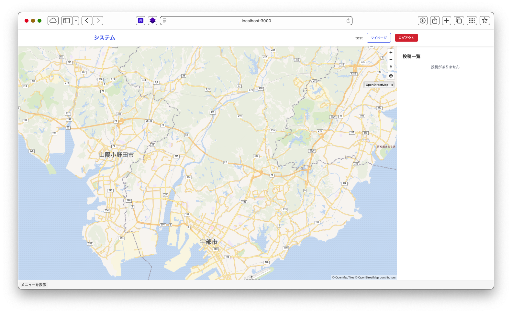
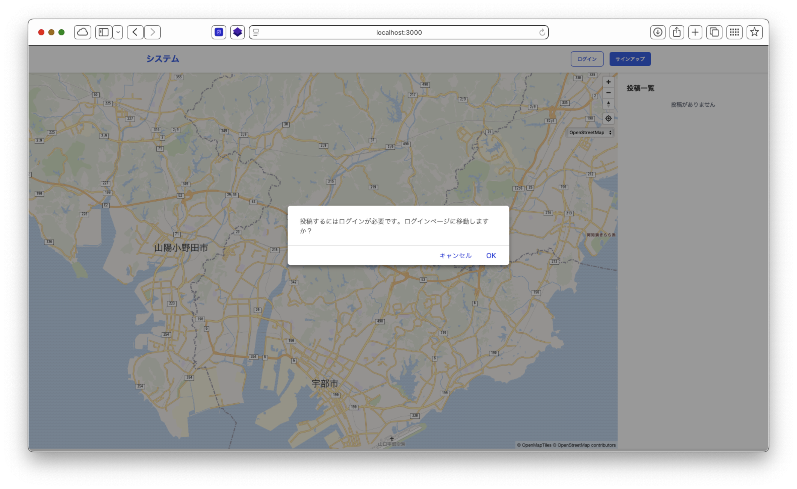
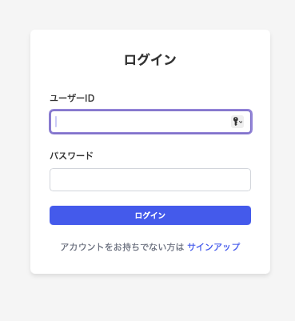
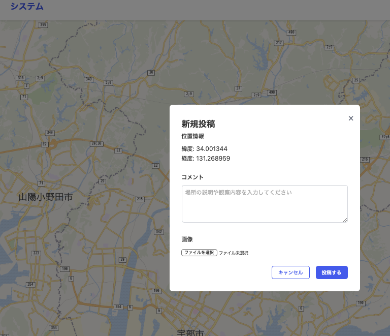
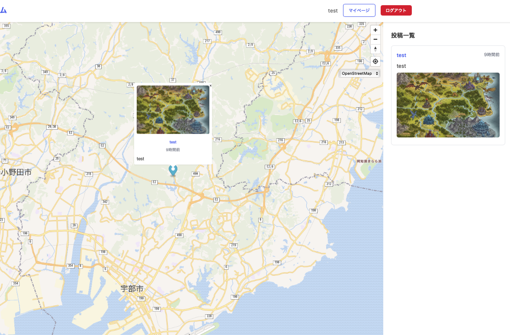
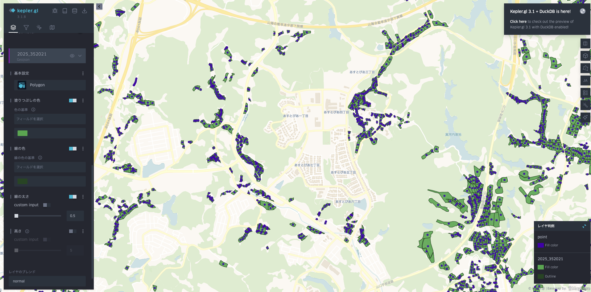
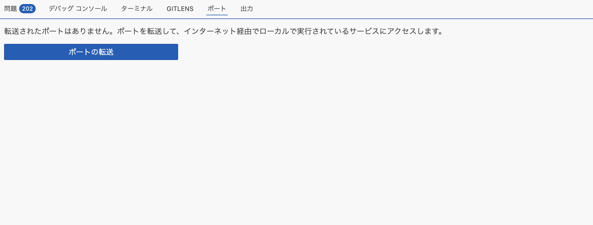
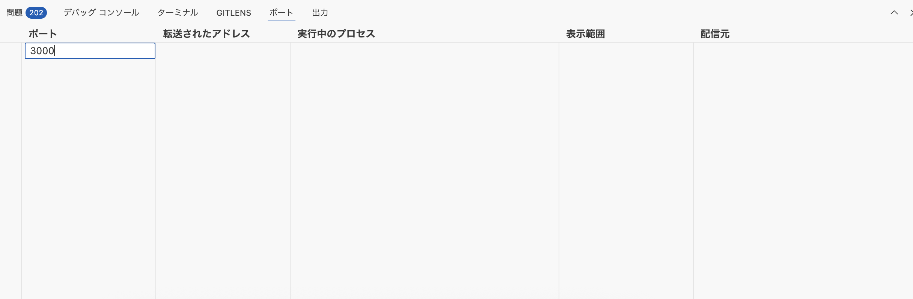
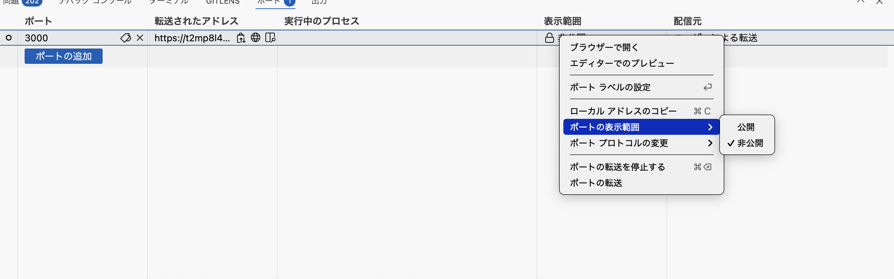

# 衛星データ解析技術研究会<br>技術セミナー（応用編）
## Webアプリケーションの開発技術の習得

第三回 2025/07/11

担当講師 : 田中聡至

---

## 本日のテーマ

### バックエンド開発① 
## バックエンドとは / サーバ環境の構築 


---

👦連絡 : ハンズオン資料に **2025-07-06** という欠番回が追加されていると思いますが、これはFOSS4G Kansai 2025にて講師が実施した`少しDeepなLeaflet`という、2024年度の衛星データ解析技術研究会 技術セミナー（応用編)の焼き直し講義の資料です。お暇な人はどうぞ。

---

## 前回やったこと

Node.jsが動く環境設定 / MapLibreの読み込み方


---


### 7/11(金)　13:30-16:00

~~13:30-13:50	前回までの復習 (フロントについてもう少し詳しく)~~
~~13:50-14:30 最終的にはこういうのをつくるよ、という例~~
14:30-14:40	-----(休憩)-----
~~14:40-16:00 データの保存をするところから~~
資料作成時点と予定が変わりました (次のページ)

---

### 7/11(金)　13:30-16:00

13:30-13:50	最終的にはこういうのをつくるよ、という例 (Docker実装)
13:50-14:30 実装解説 
14:30-14:40	-----(休憩)-----
14:40-15:30 擬似ファイル読み込みの例いろいろ
15:30-16:00 MapLibreの基本機能を見ていこう (アイコンの表示、ラインの表示など)


---

## 今後の全体像

### バックエンド開発①
バックエンドとは / サーバ環境の構築

### バックエンド開発②
動的なWebアプリとは

### バックエンド開発③
フロントエンドとの接続

### バックエンド開発④
デプロイ

---

## [セミナー募集時点での内容]
昨年度のカリキュラムにおいて作成を行なったFirebaseを用いた現地調査ツールを参考に、WebGISにおける、データの永続化が図れている環境についてポイントの解説を行う。
上記を踏まえたうえで、Webアプリケーションのデプロイとはなにか、どのような環境(PaaS / IaaS)が存在するのかに加え、バックエンドとミドルウェアについて学ぶ。
セミナー最終回までに実装を行うシステムについての全体像を掴むことを目標とする。

---

ハンズオンのページを開きながら受講すると便利かも

https://alt9800.github.io/2025-RemoteSensingSeminar/handson/2025-07-11/

---

> 動的なWebアプリケーションとは？
### DBに保存された値によってフロントに表示される値が変わるサイト

Leaflet + Firebase (FireStore , CloudStorage)
https://project-4415519406887009516.web.app


(第一回で触れている内容です)

---

# 第六回までで完成する予定のアプリの外観

---
非ログイン時




---

非ログイン時




---




---
データ追加






---

ログの例1

```
Server is running on port 3000
Environment: development
Public directory: /Users/alex/Downloads/express/public
Connected to SQLite database
2025-07-17T20:52:07.950Z - GET /
2025-07-17T20:52:08.060Z - GET /
2025-07-17T20:52:08.163Z - GET /css/style.css
2025-07-17T20:52:08.179Z - GET /js/common.js
2025-07-17T20:52:08.179Z - GET /js/auth.js
2025-07-17T20:52:08.180Z - GET /js/map.js
2025-07-17T20:52:08.876Z - GET /apple-touch-icon-precomposed.png
404 Not Found: /apple-touch-icon-precomposed.png
2025-07-17T20:52:09.091Z - GET /favicon.ico
404 Not Found: /favicon.ico
2025-07-17T20:52:09.301Z - GET /apple-touch-icon.png
404 Not Found: /apple-touch-icon.png
```

---
ログの例2
```
2025-07-17T20:55:51.386Z - GET /js/map.js
2025-07-17T20:55:51.825Z - GET /api/posts
2025-07-17T20:56:33.959Z - POST /api/posts
2025-07-17T20:56:35.341Z - GET /api/posts
2025-07-17T20:56:35.347Z - GET /uploads/1752785793975-15964498.png
2025-07-17T20:57:05.856Z - GET /
2025-07-17T20:57:05.898Z - GET /css/style.css
2025-07-17T20:57:05.900Z - GET /js/common.js
2025-07-17T20:57:05.900Z - GET /js/auth.js
2025-07-17T20:57:05.901Z - GET /js/map.js
2025-07-17T20:57:06.306Z - GET /api/posts
2025-07-17T20:57:06.314Z - GET /uploads/1752785793975-15964498.png
2025-07-17T20:57:07.077Z - GET /signup/
2025-07-17T20:57:07.083Z - GET /js/auth.js
2025-07-17T20:57:07.084Z - GET /css/style.css
2025-07-17T20:57:07.084Z - GET /js/common.js
```
---


## Q.
Dockerを使うと何が嬉しいか？

## A.
OSやディストリの様な環境ごとの差分を吸収し、どのチームメンバーのデバイスでもレシピ(Dockerfile)に基づいて同じ実行環境を用意することができます。

詳しくは第五回や第六回にて触れます。今回はサンプルアプリの実行環境として利用しているんだな、くらいで見てもらえれば十分です。


---

## 機能要件 (現地調査ツールをイメージしながら)

- メールアドレスとパスワード(6文字以上)、一意のユーザID文字列の要件で登録
- ユーザID文字列 + パスワードでログイン可能
- (/) : 地図の表示機能 / クリックでモーダルが出現し、新規地点にコメント共に画像を投稿する画面右側にはテーブルが出現 , (/Signup) , (/login) ,  (/mypage) : 自身の投稿一覧の管理 , (/logout)
- ヘッダーにトップへの回帰ボタン(「システム」の文字)と非ログイン状態だとログインボタンとサインインボタンを、ログイン状態だとマイページボタンとログアウトボタンを用意
- すべてのページはindex.htmlで静的に管理し、それぞれのフォルダが機能の名前になる構造である。
- 地図はMapLibreGL JSを用いてCDNでライブラリを読み込むような形式 (フロント)


---

## サーバーサイドがあるとどういう点で嬉しいか

クライアントサイド(JSやマークアップによる実行環境)だけでは不可能な処理を行うことができます。

主に
**DBへの書き込み、セッション管理**とそれによって実現可能な技術が利用できるようになります。

CLIによるコマンドをバックグラウンドで独立して動かすことでさらに色々な処理を並行で行うこともできる。
地理空間情報においては
タイルサーバーやリアルタイムの同期処理(Socketなど)やデータ分析・機械学習基盤の運用なども可能になるでしょう。
バッチジョブなどこの階層に含まれます。(最新の衛星データを取得してきてコレクションし、Webアプリ側からも参照できるようにする、など。)


---


## Webアプリを支える要件

- ルーティング (View)
- マークアップ(テンプレート)エンジン (View)
- データベースの読み書きやその抽象化 (Model)
- 認証認可 (Model)
- これらの制御 (Controller)


これらの機能をやさしく扱えるようにするための仕組みがWebフレームワークには揃っています。
初めてのバックエンド開発で、上記の機能が必要になったら、フレームワークを使うと便利であることが多いです。
もちろん、フレームワークより小さいライブラリを使ってフルスクラッチしるのも手です。
(繰り返し処理が少ない場合、MVCにおいてはコントローラ部分が冗長で、性能を活かせなかったりします...)

---

# MVCアーキテクチャ

Model-View-Controller

フルスタックと言われるWebフレームワークで採用されているよく「形式」です。

C# のASP / JavaのSpring / Ruby on Rails / PHPのLaravel などもMVCのアーキテクチャを採用しています。


---

### シンプルなリクエストの例がDBやViewの構築までどの様に伝わるか
```
     ┌─────────────┐
     │   User      │
     └──────┬──────┘
            │ Request
            ▼
     ┌─────────────┐
     │ Controller  │ <─── "Traffic Director"
     └──┬───────┬──┘
        │       │
  Update│       │Select
        ▼       ▼
┌───────────┐ ┌───────────┐
│   Model   │ │   View    │
│           │ │           │
│ Business  │ │ Display   │
│  Logic    │ │  Logic    │
└───────────┘ └───────────┘
    "Data"      "UI"
```

---

## 他のアーキテクチャ構造

オニオンアーキテクチャ / マイクロサービス など


---


## Node.jsのフレームワーク

- Express
- Fastify
- NestJS
- Koa
- Hono

---

## Pythonのフレームワーク

- Flask
- Django
- FastAPI


---

# データを擬似的に永続化する手段

---

## [IndexedDB](./pseudo-DB/useIndexedDB/)

この様な感じでデータが格納されます。
```json
{id: "1752792726584", coordinates: [139.70377655029148, 35.728154509073775], timestamp: "2025-07-17T22:52:06.584Z", description: "test", imageBlob: File}
```

また、実体としては
```
~/Library/Safari/Databases/
~/Library/Application Support/Google/Chrome/Default/IndexedDB/
```
などローカルにデータベースが存在している格好です。

☝️ ブラウザの開発者ツールから、保存実体を確認してみましょう！

---

ファイル構造については
```

DBのドメイン/
  ├── .metadata
  ├── database.sqlite  # メタデータ
  └── 1/              # 実際のデータファイル
      ├── 00001.blob
      └── 00002.blob
```
の様になっていて、KV型のNoSQLとして振る舞います。


容量も大きく、ご利用のマシンの空き容量次第で、GB級のストレージをつくることも可能です。


---

一般のキーバリューストアと同様に、リレーショナルの様な挙動をさせることや、外部キーもどきをつかったり、joinの様な挙動を行ったりすることもできます。

この辺りは**LocalStorage**だけでは叶えられないポイントでもあります。

次の項目へ...


---

##  [LocalStorage](./pseudo-DB/useLocalStorage/)


---

LocalStorageはブラウザにもよりますが、保存領域は*オリジンごとに*5MB~10MBです。

IndexedDBであっても、Localstorageであっても、「Cookieとサイトデータ削除」すると、すべてのデータが削除されます。

IndexedDBは永続化(ロック)のような仕組みもあります。


☝️ ブラウザの開発者ツールから、保存実体を確認してみましょう！

---

### ちなみに

SessionStorage : タブを開いている間有効になる保存領域(フォームの中途入力など)

Cache : オフライン時に利用するデータなど (Service Workerdで活用される) 実体はキャッシュディレクトリ内にファイルがあります。

Cookie : サーバーと連携するための小さなテキストデータの保持領域

---

##  [DuckDB](./pseudo-DB/useDuckDB/)

ブラウザでSQLを利用することができます。
https://duckdb.org/docs/stable/clients/wasm/overview.html

---

DuckDBの良さ

* 列志向なので読み込み効率が良い。
* 100万オーダーでも軽快に動く。
* SQLの流し込みができる。集計などもSQLで済む。

用途

* ストレージサーバに置いてある実体を、クライアント側で処理を行う。

---
読み込み形式の多様さを生かして、csvの処理を行うことも簡単です。
```html
<!doctype html>
<html lang="ja">
<head>
    <meta charset="utf-8">
    <title>DuckDB-Wasm Demo</title>
</head>
<body>
    <input type="file" id="file" accept=".csv,.parquet">
    <button id="run">実行</button>
    <pre id="log">[/]</pre>
    <script type="module">
        import duckdb from '@duckdb/duckdb-wasm';
        import { Table } from 'apache-arrow';
        (async () => {
            const bundles = duckdb.getJsDelivrBundles();
            const bundle = await duckdb.selectBundle(bundles);
            const worker = new Worker(bundle.mainWorker);
            const logger = new duckdb.ConsoleLogger();
            const db = new duckdb.AsyncDuckDB(logger, worker);
            await db.instantiate(bundle.mainModule, bundle.pthreadWorker);
            const conn = await db.connect();
            document.getElementById('run').onclick = async () => {
                const fileInput = document.getElementById('file');
                if (!fileInput.files.length) {
                    alert('ファイルを選択してください');
                    return;
                }
                const file = fileInput.files[0];
                const buffer = await file.arrayBuffer();
                await conn.registerFile('input.csv', new Uint8Array(buffer));
                const res = await conn.query(
                    "SELECT product, SUM(sales) AS total FROM 'input.csv' GROUP BY product;"
                );
                document.getElementById('log').textContent = JSON.stringify(res, null, 2);
            };
        })();
    </script>
</body>
</html>
```

---

DuckDBはあくまでもインメモリデータベースなので、リロードでデータが揮発します。

データの永続化を考えると、DuckDBで解析を担当し、実体の保存はIndexedDBに任せるのが現実的でしょうか？

実用例
https://zenn.dev/shiguredo/articles/duckdb-wasm-s3-parquet-opfs

参考
[DuckDB-Wasm の HTMLファイルのみで試せる公式サンプルを書きかえたりもして試す #JavaScript - Qiita](https://qiita.com/youtoy/items/bbdd13585577119592b3)

---

[Node.jsを使ってファイル書き込みをするパターン](./pseudo-DB/useNodejs/)


---

ここからはcsvやjsonのファイルの読み込みについて復習しておきます。

💡 ローカルのファイルを読んでいるのか、HTTPでファイルをリクエストしているのかはよく考えましょう。

---

## CSVを読み込みたい <span class="tiny-text">CSV形式からデータを取り出す / ローカルで読み込む</span>

```js
fetch('path/to/your/file.csv')
  .then(response => {
    // レスポンスのステータスをチェック
    if (!response.ok) {
      throw new Error(`HTTP error! status: ${response.status}`);
    }
    return response.text();
  })
  .then(csvText => {
    // CSVテキストを行に分割
    const rows = csvText.split('\n');
    
    // データを格納する配列
    const data = [];
    
    // ヘッダーを取得
    const headers = rows[0].split(',');
    
    // データ行を処理
    for (let i = 1; i < rows.length; i++) {
      // 空行をスキップ
      if (rows[i].trim() === '') continue;
      
      const values = rows[i].split(',');
      const rowObject = {};
      
      // オブジェクトに変換
      headers.forEach((header, index) => {
        rowObject[header.trim()] = values[index] ? values[index].trim() : '';
      });
      
      data.push(rowObject);
    }
    
    // 処理したデータをコンソールに出力
    console.log(data);
  })
  .catch(error => {
    // ネットワークエラーや他の例外をキャッチ
    console.error('CSVの読み込み中にエラーが発生しました:', error);
  });
```
---

☝️ ページ読み込み時(Javascript実行時)にcsvを読み込む方法で基本的には問題ないと思いますが、同じ形式のcsvで、読み込むファイルが複数あり、ユーザ側で選びたい場合は、DOMと連動した読み込みポイントを作ると良いかもしれません。


---

### 復習 : ファイルを読み込みたい時

* Ajax (jQuery)
* XMLHttpRequest (従来的によく実装で使われてた)
* Axios (やや新しめのHTTP処理クライアント)

できるだけWeb標準を使いたいという気持ちがあれば前項の**FetchAPI**を使うことをお勧めします。

なお、サーバーサイドとして、Node.jsがある場合は`fs`でファイルを読み込んでNode.js内で処理するパターンが多いでしょう。
また、ブラウザ上で`FileReader API`を使うとローカルファイルを読み込むことができます。


---

## 💡検討ポイント

### 設計において列ごとに緯度経度を分けるか否か

```
|latitude|longitude|
|33.9519|131.2467|
```

```
|geometory|
|131.2467,33.9519|
```

csvは結局、Javascriptで扱える型(オーソドックスには配列、オブジェクト型に変換しても良い)への処理を自分で設計しなければいけないことの方が多いかもしれません。

各セルに入る項目にもJSONと異なり「型」が存在しないので、区切り方も自由度が高いです(良し悪し。とはいえ、プログラムでパースすることに念頭においたCSVの構造設計を心がけた方が良いと思います。)

---

🐤 CSV読み込みの難しさ 🐤

どこの列に地理情報が入っているか分かった上で、値を活用する部分の処理を書かなくてはいけないことが多いでしょう。

→ 読み込んだあとでどの列の項目を使うか、csvからTableを作成し、必要な項目を選んで地図上にプロットする方法など取れます。
(https://alt9800.github.io/2025-RemoteSensingSeminar/handson/2025-07-11/csv-perse)

💡 ヘッダー行を設定の有無を気をつけましょう！
💡 空のセルをスキップ(しつつ、読み込めなかった行をconsole.logに出すなど)する実装をすると汎用的かも！
💡 改行文字による処理ミスもあるあるです。

---

## ☝️ローカルのCSVファイルを選んでテーブルにしてみよう

---

DOM側
```html
<!DOCTYPE html>
<html>
<body>
  <input type="file" id="csvFileInput" accept=".csv">
  <table id="csvTable"></table>

  <script src="script.js"></script>
</body>
</html>
```
次ページにScriptを記載しています。

---
```javascript
document.getElementById('csvFileInput').addEventListener('change', function(e) {
  const file = e.target.files[0];
  const reader = new FileReader();

  reader.onload = function(event) {
    const csvText = event.target.result;
    const rows = csvText.split('\n');
    const table = document.getElementById('csvTable');
    
    // テーブルをクリア
    table.innerHTML = '';

    rows.forEach((row, index) => {
      const tr = document.createElement('tr');
      const cells = row.split(',');

      cells.forEach(cell => {
        const td = document.createElement(index === 0 ? 'th' : 'td');
        td.textContent = cell.trim();
        tr.appendChild(td);
      });

      table.appendChild(tr);
    });
  };

  reader.readAsText(file, 'UTF-8');
});


```

---

### 💡 csvの読み込みに際して拡張ライブラリを利用したい

CSV-Parse
Papa Parse

などがよく使われているほか、データの可視化まで検討するのであれば、第一回で触れたd3.jsなどを使うのも手かもしれません。

これらのライブラリで助かるのは、形式変換よりもむしろ**正規表現**の処理です。

---


### おまけ : 住所しかデータがない場合
CSISのシステムで住所情報を一括で緯度経度に変換することができます。
https://geocode.csis.u-tokyo.ac.jp/geocode-cgi/geocode.cgi?action=start

キーワード : ジオエンコード / ジオデコード

💡 文字コードはWindowsをお使いの方もUTF-8を利用する方がよいです。

---

## GeoJSONを読み込みたい

```js
fetch('path/to/your/file.geojson')
  .then(response => {
    if (!response.ok) {
      throw new Error(`HTTP error! status: ${response.status}`);
    }
    return response.json();
  })
  .then(geojsonData => {
    // GeoJSONデータの基本的な検証
    if (geojsonData.type && ['FeatureCollection', 'Feature', 'Point'].includes(geojsonData.type)) {
      console.log('GeoJSON読み込み成功:', geojsonData);
      
      // 追加の処理例
      if (geojsonData.type === 'FeatureCollection') {
        console.log('フィーチャー数:', geojsonData.features.length);
      }
    } else {
      console.warn('無効なGeoJSON形式');
    }
  })
  .catch(error => {
    console.error('GeoJSONの読み込み中にエラーが発生しました:', error);
  });
```
---

💡 GeoJSONについては通常のJSONに対して、よりいっそう形式が決まっているので、概ね同じ方法でObject型の変数として扱いやすいです。


---
### GeoJSONの構成について

#### ジオメトリタイプ:
Point: 単一の位置点
LineString: 連続した線
Polygon: 閉じた多角形
MultiPoint: 複数の点
MultiLineString: 複数の線
MultiPolygon: 複数の多角形
GeometryCollection: 複数のジオメトリオブジェクト
#### フィーチャータイプ:
Feature: 単一のジオメトリと追加のプロパティ
FeatureCollection: 複数のフィーチャーのコレクション


---

### JSONを読み込むだけならさらに簡単

```js
fetch('path/to/your/file.json')
  .then(response => {
    // レスポンスのステータスをチェック
    if (!response.ok) {
      throw new Error(`HTTP error! status: ${response.status}`);
    }
    return response.json(); // JSONとして直接パース
  })
  .then(data => {
    // 読み込んだJSONデータを処理
    console.log(data);
  })
  .catch(error => {
    // ネットワークエラーや解析エラーをキャッチ
    console.error('JSONの読み込み中にエラーが発生しました:', error);
  });
```

---
JSON型は構文がObjectと類似していることに加え、

**オブジェクト → JSON** は JSON.stringify();

**JSON → オブジェクト** は JSON.parse()

で容易に変換可能です 

---

## 筆ポリゴンを使ってみよう！


筆ポリゴンの例
https://www.maff.go.jp/j/tokei/porigon/index.html
(リンク https://open.fude.maff.go.jp)
筆ポリゴンの利用規約
https://opendata.fude.maff.go.jp/筆ポリゴンの利用規約.pdf

☝️ 筆ポリゴンからデータをDLしてみましょう

💡筆ポリゴンからダウンロードするデータは拡張子を`.geojson`にリネームする必要があります


---

## 逆に、データのエクスポートをしたい場合のサンプル

https://alt9800.github.io/2025-RemoteSensingSeminar/handson/2025-07-11/csv-n-json-export


具体的な説明は以下の項目に
https://alt9800.github.io/2025-RemoteSensingSeminar/handson/2025-07-11/

ソース
https://github.com/alt9800/2025-RemoteSensingSeminar/tree/main/2025-07-11/handson/csv-n-json-export

---

## Q. ブラウザから(クライアントのみで)ファイルへの「書き込みはできないの？」

## A. 基本的にできません。

LocalStorageやIndexedDBの様に、クライアント側の不揮発性メモリ領域を用いてデータを保存することができる部分を用いて、適切なエクスポートを助ける戦略を取ると良いでしょう。

```
🙅ブラウザのセキュリティの都合上、HTTPを用いてできないこと🙅
// - ローカルファイルへの直接書き込み
// - 特定のファイルパスへの自動保存
// - ファイルの上書き保存
```
これらが可能だと攻撃者はユーザのローカルにあるファイルをいじり放題になってしまいます。

---

## 便利なツール類

---

GeoJSON ( TopoJSON ) に加え、KML やShapefileは**Loaders.gl**を使うとよいでしょう。
(GeoTIFFやglTFのような形式も対応している様です。)


---


### Q. とりあえずどんなデータか見てみたい

### A.  Kepler.GLはどうでしょうか？
https://kepler.gl

deck.glとMapLibreGL JSのGIS・3Dライブラリに、Loaders.jsなどを組み合わせた可視化基盤です。


☝️ 試しに筆ポリゴンのデータを読み込ませてみましょう


---




---

### Q.任意のGeoJSONを作りたい

### A Geojson.io が良いかも

https://geojson.io/

Mapbox社が提供しているWebアプリケーションで、
点を打ったりラインやポリゴンを描いたものをGeoJSON形式で保存できます。
また、簡易的なビューワとしても使えます。


---

# MapLibre補足

---

### 講義中に見たサンプルいろいろ
[MapLibre GL JS](https://maplibre.org/maplibre-gl-js/docs/)

[マーカーの追加](https://maplibre.org/maplibre-gl-js/docs/examples/add-a-default-marker/)


[マーカーにホバーをつけたい](https://maplibre.org/maplibre-gl-js/docs/examples/display-a-popup-on-hover/)

[ラインを引きたい](https://maplibre.org/maplibre-gl-js/docs/examples/add-a-geojson-line/)

[ポリゴンを表現したい](https://maplibre.org/maplibre-gl-js/docs/examples/add-a-geojson-polygon/)

[GeoJSONを読み込む例も公式にサンプルがあります](https://maplibre.org/maplibre-gl-js/docs/examples/view-local-geojson/)


[アニメーションを行いたい](https://maplibre.org/maplibre-gl-js/docs/examples/animate-a-line/)

[地形を表したい](https://maplibre.org/maplibre-gl-js/docs/examples/3d-terrain/)


[ヒートマップを作りたい](https://maplibre.org/maplibre-gl-js/docs/examples/create-a-heatmap-layer/)

[ポイントクラスターをつくりたい](https://maplibre.org/maplibre-gl-js/docs/examples/create-and-style-clusters/)


---

### 参考リンク


[ArcGIS で Cloud Optimized GeoTIFF (COG) を触ってみる - フリーダムの日記](https://freedom-tech.hatenablog.com/entry/2023/08/20/210800)

[MapLibre GL JS+標高タイルで3D地形を表示する方法 #JavaScript - Qiita](https://qiita.com/shi-works/items/2d712456ccc91320cd1d)


---


こういう形式を知っておくと良いかも

* GeoParquet
* 3D tiles
* COG
* FlatGeoBuff
* GeoArrow (←AIくんが教えてくれました)


---

# 実行環境公開のサポート

---

📝VSCodeのポートフォワードを用いてlocalhostの実行環境をインターネット経由でチームメンバーに公開することができます。


https://code.visualstudio.com/updates/v1_82#_workbench


---
ctrl + @ などで下部のコンソールを開いき、「ポートの転送」をおこないます。


---
GitHub等にログイン状態で、現在サーバーが動いているポートを指定すると外部公開が始まります。



---
「転送されたアドレス」の欄から転送を解除できる他、この項目に表示されるアドレスを共有することで、他のユーザがローカルホストで表示されている項目にアクセスできるようになります。
また、公開や非公開の範囲も設定できます。



---

### 似た様なVSCodeの拡張機能

### LiveShare 
自身のVSCodeをインターネットに公開して、同時にファイルなどを編集できます。
(要Macrosoft or GitHubアカウント)

### リモートトンネル 
(sshなどを使って)自分のPC内のCLIやVSCodeにクラウド経由で外部から接続してもらうことができます。
