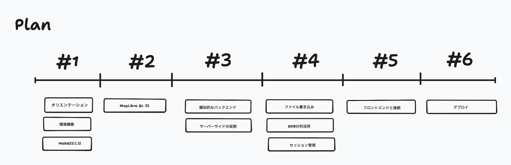
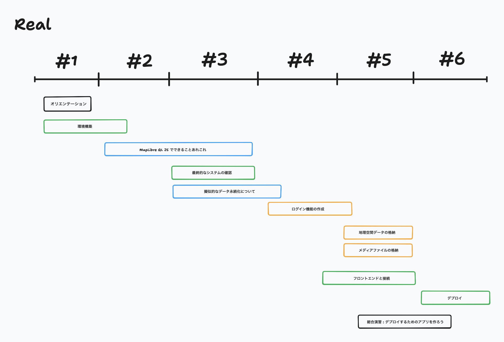

# 衛星データ解析技術研究会<br>技術セミナー（応用編）
## Webアプリケーションの開発技術の習得

第五回 2025/07/25

担当講師 : 田中聡至

---

お知らせ 1
Slackのリンク
https://join.slack.com/t/2025-qzu7873/shared_invite/zt-39hkj0z6q-8vt0qOy7h1zJ7Ug9mwM~7A

なんらかの原因で、Slackに入れなくなった方はこちらから
8/15にリンクが消失します。
(講義後はSlackのお部屋はアーカイブせずに消えるまで残す予定です。シンプルなテキストとしてバックアップはとります。)


---

お知らせ 2
https://alt9800.github.io/2025-RemoteSensingSeminar/
講義資料はスライド (pdf)だと、コードのコピペがしにくかったので、
講義資料のコードブロックが利用しやすいようにhtmlでも提供するようにしました。


---



---




---

前回のあらすじ

### ゆるいMVC
Model: データベース処理（ただしroutes内に混在しており、単一責任原則は満たさない）
View: 静的HTML + JSON API
Controller: routes以下

(そもそもExpress.js自体がroutes以下にControllerとModel両方の役割を持つ構成になる)

---

🐤前回はあまり触れませんでしたが、やったこと単位でgitにセーブポイント(commit)を追加していくとよいかも

---


```
src/
└── routes/
    ├── auth.js       # 認証コントローラー
    ├── users.js      # ユーザーコントローラー
    └── posts.js      # 投稿コントローラー
```


---

各ライブラリの役割(第5回目までの内容を補足)
```
アプリケーション
├── express (Webフレームワーク)
│   ├── cors (CORS設定)
│   ├── helmet (セキュリティヘッダー)
│   └── express-validator (入力検証)
├── 認証機能
│   ├── jsonwebtoken (トークン管理)
│   └── bcrypt (パスワード暗号化)
├── データ永続化
│   └── sqlite3 (データベース)
├── ファイル処理
│   └── multer (アップロード)
└── 設定・開発
    ├── dotenv (環境変数)
    └── nodemon (開発用)
```

---

# 投稿機能を作ろう！

---

scripts/init-db.js

```js
const sqlite3 = require('sqlite3').verbose();
const path = require('path');
const fs = require('fs');
const dotenv = require('dotenv');

// 環境変数の読み込み
dotenv.config();

// データベースディレクトリの作成
const dbDir = path.join(__dirname, '../db');
if (!fs.existsSync(dbDir)) {
  fs.mkdirSync(dbDir, { recursive: true });
}

// データベースパス
const dbPath = process.env.DB_PATH || path.join(dbDir, 'database.db');

// データベースの初期化
const db = new sqlite3.Database(dbPath);

console.log('Initializing database...');

db.serialize(() => {
  // ユーザーテーブル（既存）
  db.run(`
    CREATE TABLE IF NOT EXISTS users (
      id INTEGER PRIMARY KEY AUTOINCREMENT,
      user_id VARCHAR(50) UNIQUE NOT NULL,
      email VARCHAR(255) UNIQUE NOT NULL,
      password_hash VARCHAR(255) NOT NULL,
      created_at TIMESTAMP DEFAULT CURRENT_TIMESTAMP
    )
  `);

  // 投稿テーブル（新規追加）
  db.run(`
    CREATE TABLE IF NOT EXISTS posts (
      id INTEGER PRIMARY KEY AUTOINCREMENT,
      user_id INTEGER NOT NULL,
      latitude REAL NOT NULL,
      longitude REAL NOT NULL,
      comment TEXT,
      image_path VARCHAR(500),
      created_at TIMESTAMP DEFAULT CURRENT_TIMESTAMP,
      updated_at TIMESTAMP DEFAULT CURRENT_TIMESTAMP,
      FOREIGN KEY (user_id) REFERENCES users(id) ON DELETE CASCADE
    )
  `);

  // インデックスの作成
  db.run('CREATE INDEX IF NOT EXISTS idx_posts_user_id ON posts(user_id)');
  db.run('CREATE INDEX IF NOT EXISTS idx_posts_location ON posts(latitude, longitude)');
  db.run('CREATE INDEX IF NOT EXISTS idx_posts_created_at ON posts(created_at DESC)');

  console.log('Database initialization completed!');
});

db.close((err) => {
  if (err) {
    console.error('Error closing database:', err);
  } else {
    console.log('Database connection closed.');
  }
});
```

---

```js
node scripts/init-db.js
```


---

☝️新規追加分の投稿テーブルに注目
```js
  db.run(`
    CREATE TABLE IF NOT EXISTS posts (
      id INTEGER PRIMARY KEY AUTOINCREMENT,
      user_id INTEGER NOT NULL,
      latitude REAL NOT NULL,
      longitude REAL NOT NULL,
      comment TEXT,
      image_path VARCHAR(500),
      created_at TIMESTAMP DEFAULT CURRENT_TIMESTAMP,
      updated_at TIMESTAMP DEFAULT CURRENT_TIMESTAMP,
      FOREIGN KEY (user_id) REFERENCES users(id) ON DELETE CASCADE
    )
  `);
```

---


## 投稿関連APIの実装

### 投稿ルートの作成

`src/routes/posts.js`を新たに作る

---

`src/routes/posts.js`

```js

const express = require('express');
const multer = require('multer');
const path = require('path');
const fs = require('fs').promises;
const { body, validationResult } = require('express-validator');
const db = require('../config/db');
const { authenticateToken, optionalAuth } = require('../middleware/auth');

const router = express.Router();

// アップロードディレクトリの作成
const uploadDir = path.join(__dirname, '../../uploads');
fs.mkdir(uploadDir, { recursive: true }).catch(console.error);

// Multerの設定（1.3で詳細設定）
const storage = multer.diskStorage({
  destination: async (req, file, cb) => {
    cb(null, uploadDir);
  },
  filename: (req, file, cb) => {
    const uniqueSuffix = Date.now() + '-' + Math.round(Math.random() * 1E9);
    cb(null, uniqueSuffix + path.extname(file.originalname));
  }
});

const upload = multer({
  storage: storage,
  limits: {
    fileSize: parseInt(process.env.UPLOAD_MAX_SIZE) || 10 * 1024 * 1024 // 10MB
  },
  fileFilter: (req, file, cb) => {
    const allowedExtensions = (process.env.ALLOWED_EXTENSIONS || 'jpg,jpeg,png,gif').split(',');
    const ext = path.extname(file.originalname).toLowerCase().substring(1);
    
    if (allowedExtensions.includes(ext)) {
      cb(null, true);
    } else {
      cb(new Error('許可されていないファイル形式です'));
    }
  }
});

// 投稿一覧の取得（認証不要）
router.get('/', optionalAuth, async (req, res) => {
  try {
    const { limit = 50, offset = 0 } = req.query;
    
    const query = `
      SELECT 
        p.id,
        p.latitude,
        p.longitude,
        p.comment,
        p.image_path,
        p.created_at,
        p.user_id,
        u.user_id as username
      FROM posts p
      JOIN users u ON p.user_id = u.id
      ORDER BY p.created_at DESC
      LIMIT ? OFFSET ?
    `;
    
    const result = await db.query(query, [parseInt(limit), parseInt(offset)]);
    
    // 画像パスを完全なURLに変換
    const posts = result.rows.map(post => ({
      ...post,
      image_url: post.image_path ? `/uploads/${path.basename(post.image_path)}` : null,
      is_owner: req.user ? post.user_id === req.user.id : false
    }));
    
    res.json({
      posts,
      total: posts.length
    });
    
  } catch (error) {
    console.error('Get posts error:', error);
    res.status(500).json({ message: 'サーバーエラーが発生しました' });
  }
});

// 特定の投稿の取得
router.get('/:id', optionalAuth, async (req, res) => {
  try {
    const { id } = req.params;
    
    const query = `
      SELECT 
        p.id,
        p.latitude,
        p.longitude,
        p.comment,
        p.image_path,
        p.created_at,
        p.user_id,
        u.user_id as username
      FROM posts p
      JOIN users u ON p.user_id = u.id
      WHERE p.id = ?
    `;
    
    const result = await db.query(query, [id]);
    
    if (result.rows.length === 0) {
      return res.status(404).json({ message: '投稿が見つかりません' });
    }
    
    const post = result.rows[0];
    res.json({
      ...post,
      image_url: post.image_path ? `/uploads/${path.basename(post.image_path)}` : null,
      is_owner: req.user ? post.user_id === req.user.id : false
    });
    
  } catch (error) {
    console.error('Get post error:', error);
    res.status(500).json({ message: 'サーバーエラーが発生しました' });
  }
});

// 新規投稿の作成（認証必要）
router.post('/', authenticateToken, upload.single('image'), [
  body('latitude').isFloat({ min: -90, max: 90 }),
  body('longitude').isFloat({ min: -180, max: 180 }),
  body('comment').optional().isLength({ max: 1000 })
], async (req, res) => {
  try {
    const errors = validationResult(req);
    if (!errors.isEmpty()) {
      // アップロードされたファイルを削除
      if (req.file) {
        await fs.unlink(req.file.path).catch(console.error);
      }
      return res.status(400).json({ errors: errors.array() });
    }
    
    const { latitude, longitude, comment } = req.body;
    const imagePath = req.file ? req.file.filename : null;
    
    const query = `
      INSERT INTO posts (user_id, latitude, longitude, comment, image_path)
      VALUES (?, ?, ?, ?, ?)
    `;
    
    const result = await db.query(query, [
      req.user.id,
      parseFloat(latitude),
      parseFloat(longitude),
      comment || '',
      imagePath
    ]);
    
    const postId = result.rows[0].id;
    
    // 作成した投稿を取得
    const getPostQuery = `
      SELECT 
        p.*,
        u.user_id as username
      FROM posts p
      JOIN users u ON p.user_id = u.id
      WHERE p.id = ?
    `;
    
    const newPost = await db.query(getPostQuery, [postId]);
    const post = newPost.rows[0];
    
    res.status(201).json({
      message: '投稿が作成されました',
      post: {
        ...post,
        image_url: imagePath ? `/uploads/${imagePath}` : null,
        is_owner: true
      }
    });
    
  } catch (error) {
    console.error('Create post error:', error);
    // エラー時はアップロードされたファイルを削除
    if (req.file) {
      await fs.unlink(req.file.path).catch(console.error);
    }
    res.status(500).json({ message: 'サーバーエラーが発生しました' });
  }
});

// 投稿の更新（コメントのみ）
router.put('/:id', authenticateToken, [
  body('comment').optional().isLength({ max: 1000 })
], async (req, res) => {
  try {
    const errors = validationResult(req);
    if (!errors.isEmpty()) {
      return res.status(400).json({ errors: errors.array() });
    }
    
    const { id } = req.params;
    const { comment } = req.body;
    
    // 所有者確認
    const checkQuery = 'SELECT user_id FROM posts WHERE id = ?';
    const checkResult = await db.query(checkQuery, [id]);
    
    if (checkResult.rows.length === 0) {
      return res.status(404).json({ message: '投稿が見つかりません' });
    }
    
    if (checkResult.rows[0].user_id !== req.user.id) {
      return res.status(403).json({ message: 'この投稿を編集する権限がありません' });
    }
    
    // 更新実行
    const updateQuery = `
      UPDATE posts 
      SET comment = ?, updated_at = CURRENT_TIMESTAMP
      WHERE id = ?
    `;
    
    await db.query(updateQuery, [comment, id]);
    
    // 更新後の投稿を取得
    const getPostQuery = `
      SELECT 
        p.*,
        u.user_id as username
      FROM posts p
      JOIN users u ON p.user_id = u.id
      WHERE p.id = ?
    `;
    
    const result = await db.query(getPostQuery, [id]);
    const post = result.rows[0];
    
    res.json({
      message: '投稿が更新されました',
      post: {
        ...post,
        image_url: post.image_path ? `/uploads/${post.image_path}` : null,
        is_owner: true
      }
    });
    
  } catch (error) {
    console.error('Update post error:', error);
    res.status(500).json({ message: 'サーバーエラーが発生しました' });
  }
});

// 投稿の削除
router.delete('/:id', authenticateToken, async (req, res) => {
  try {
    const { id } = req.params;
    
    // 所有者確認と画像パスの取得
    const checkQuery = 'SELECT user_id, image_path FROM posts WHERE id = ?';
    const checkResult = await db.query(checkQuery, [id]);
    
    if (checkResult.rows.length === 0) {
      return res.status(404).json({ message: '投稿が見つかりません' });
    }
    
    if (checkResult.rows[0].user_id !== req.user.id) {
      return res.status(403).json({ message: 'この投稿を削除する権限がありません' });
    }
    
    const imagePath = checkResult.rows[0].image_path;
    
    // 削除実行
    await db.query('DELETE FROM posts WHERE id = ?', [id]);
    
    // 画像ファイルの削除
    if (imagePath) {
      const fullPath = path.join(uploadDir, imagePath);
      await fs.unlink(fullPath).catch(console.error);
    }
    
    res.json({ message: '投稿が削除されました' });
    
  } catch (error) {
    console.error('Delete post error:', error);
    res.status(500).json({ message: 'サーバーエラーが発生しました' });
  }
});

// ユーザーの投稿一覧
router.get('/user/:userId', optionalAuth, async (req, res) => {
  try {
    const { userId } = req.params;
    const { limit = 50, offset = 0 } = req.query;
    
    const query = `
      SELECT 
        p.id,
        p.latitude,
        p.longitude,
        p.comment,
        p.image_path,
        p.created_at,
        p.user_id,
        u.user_id as username
      FROM posts p
      JOIN users u ON p.user_id = u.id
      WHERE u.user_id = ?
      ORDER BY p.created_at DESC
      LIMIT ? OFFSET ?
    `;
    
    const result = await db.query(query, [userId, parseInt(limit), parseInt(offset)]);
    
    const posts = result.rows.map(post => ({
      ...post,
      image_url: post.image_path ? `/uploads/${path.basename(post.image_path)}` : null,
      is_owner: req.user ? post.user_id === req.user.id : false
    }));
    
    res.json({
      posts,
      total: posts.length
    });
    
  } catch (error) {
    console.error('Get user posts error:', error);
    res.status(500).json({ message: 'サーバーエラーが発生しました' });
  }
});

module.exports = router;
```

---

認証ミドルウェアの更新
src/middleware/auth.jsにoptionalAuthを追加：
(お尻につけるだけでOK)

---

```js
const jwt = require('jsonwebtoken');

const JWT_SECRET = process.env.JWT_SECRET || 'your-jwt-secret-key-change-in-production';

// JWTトークンの生成
const generateToken = (user) => {
  return jwt.sign(
    { 
      id: user.id, 
      user_id: user.user_id,
      email: user.email 
    },
    JWT_SECRET,
    { expiresIn: '7d' }
  );
};

// 認証ミドルウェア
const authenticateToken = (req, res, next) => {
  const authHeader = req.headers['authorization'];
  const token = authHeader && authHeader.split(' ')[1];

  if (!token) {
    return res.status(401).json({ message: '認証トークンが必要です' });
  }

  jwt.verify(token, JWT_SECRET, (err, user) => {
    if (err) {
      return res.status(403).json({ message: 'トークンが無効です' });
    }
    req.user = user;
    next();
  });
};

// オプショナル認証（ログインしていなくてもOK）
const optionalAuth = (req, res, next) => {
  const authHeader = req.headers['authorization'];
  const token = authHeader && authHeader.split(' ')[1];

  if (!token) {
    return next();
  }

  jwt.verify(token, JWT_SECRET, (err, user) => {
    if (!err) {
      req.user = user;
    }
    next();
  });
};

module.exports = {
  generateToken,
  authenticateToken,
  optionalAuth
};
```


---

`src/server.js`を更新して投稿ルートを追加：
```js

const express = require('express');
const path = require('path');
const helmet = require('helmet');
const cors = require('cors');
const dotenv = require('dotenv');

// 環境変数の読み込み
dotenv.config();

const app = express();
const PORT = process.env.PORT || 3000;

// ミドルウェアの設定
app.use(helmet({
  contentSecurityPolicy: false,
  crossOriginEmbedderPolicy: false,
}));

app.use(cors());
app.use(express.json());
app.use(express.urlencoded({ extended: true }));

// 静的ファイルの配信
app.use(express.static(path.join(__dirname, '../public')));
app.use('/uploads', express.static(path.join(__dirname, '../uploads')));

// ルーターのインポート
const authRoutes = require('./routes/auth');
const usersRoutes = require('./routes/users');
const postsRoutes = require('./routes/posts');  // 追加

// APIルートの設定
app.use('/api/auth', authRoutes);
app.use('/api/users', usersRoutes);
app.use('/api/posts', postsRoutes);  // 追加

// エラーハンドリング
app.use((err, req, res, next) => {
  console.error('Error:', err.stack);
  res.status(err.status || 500).json({
    message: err.message || 'Internal Server Error',
    ...(process.env.NODE_ENV === 'development' && { stack: err.stack })
  });
});

// 404ハンドラー
app.use((req, res) => {
  res.status(404).json({ message: 'Not Found' });
});

// サーバー起動
app.listen(PORT, () => {
  console.log(`Server is running on port ${PORT}`);
  console.log(`Environment: ${process.env.NODE_ENV}`);
});
```

---

.envファイルに以下を追加：

```sh
# アップロード設定
UPLOAD_MAX_SIZE=10485760  # 10MB
ALLOWED_EXTENSIONS=jpg,jpeg,png,gif
```

概ねよくやる設定です。

---

```sh
mkdir -p uploads
#gitを使う人は下も
touch uploads/.gitkeep
```

---

## ここで一旦テスト

1. データベースの再初期化
```sh
node scripts/init-db.js
```
2. サーバーの起動
```sh
npm run dev
```
3. APIテスト（curl）

投稿一覧の取得（認証不要）: GETなのでブラウザでも...
```sh
curl http://localhost:3000/api/posts
```

---
テスト投稿

```sh
# まずログイン
TOKEN=$(curl -s -X POST http://localhost:3000/api/auth/login \
  -H "Content-Type: application/json" \
  -d '{"user_id": "testuser", "password": "password123"}' \
  | grep -o '"token":"[^"]*' | grep -o '[^"]*$')
```

```sh
# 投稿作成（画像なし）
curl -X POST http://localhost:3000/api/posts \
  -H "Authorization: Bearer $TOKEN" \
  -H "Content-Type: application/json" \
  -d '{
    "latitude": 33.9980,
    "longitude": 131.2463,
    "comment": "テスト投稿です"
  }'
```

---

```sh
# 投稿作成（画像付き）
curl -X POST http://localhost:3000/api/posts \
  -H "Authorization: Bearer $TOKEN" \
  -F "latitude=33.9980" \
  -F "longitude=131.2463" \
  -F "comment=画像付き投稿" \
  -F "image=@/path/to/test.jpg"
```


---
GETリクエスト比較

### 方法1: URLに直接パラメータ
```sh
curl -X GET "https://example.com/api/users?name=John&age=30&city=Tokyo"
```

### 方法2: -Gオプションと--data-urlencode
```sh
curl -G https://example.com/api/users \
     -d "name=John" \
     -d "age=30" \
     -d "city=Tokyo"
(スマホからリクエストしてもいいかも)
```

---

# CRUD

☝️作成したエンドポイントの動作を確認してみましょう

---

### 特定の投稿を取得
```sh
curl http://localhost:3000/api/posts/1
```
### 投稿の更新
```sh
curl -X PUT http://localhost:3000/api/posts/1 \
  -H "Authorization: Bearer $TOKEN" \
  -H "Content-Type: application/json" \
  -d '{"comment": "更新されたコメント"}
```
### 投稿の削除
```sh
curl -X DELETE http://localhost:3000/api/posts/1 \
  -H "Authorization: Bearer $TOKEN"
```
### ユーザー別投稿一覧
```sh
curl http://localhost:3000/api/posts/user/testuser
```

---


RESTfulとはなにか？


---

OpenAPI 規格


---

シングルページアプリケーションについて

ルーティング(APIエンドポイント)のパターンが変わる

---


ホワイトリストとブラックリスト


---


TLSについて


---


今週の実験

GPS / GNSS ログデータを表示しよう


---

OpenStreetMap自体をうまく使う

---


強くMVCに乗っ取ることよりも、どこにどの役割があるのかを意識する方が大切

---


次回に向けてのワーク


実際にデプロイするアプリケーションを作ろう！！


予告をしておくと、Docker形式だと

---

[AppRun β版 | さくらのクラウド マニュアル](https://manual.sakura.ad.jp/cloud/manual-sakura-apprun.html)

[コンテナレジストリ | さくらのクラウド マニュアル](https://manual.sakura.ad.jp/cloud/appliance/container-registry/index.html)


---

コンテナ作成の手順(さくらのAppRun編)

1. さくらインターネットのアカウントを作成
2. ダッシュボードよりさくらのAppRunに移動する (ホーム > [AppRun](https://secure.sakura.ad.jp/apprun/applications) )
3. 「さくらのクラウド」ページ(ホームより一段下ったページ)のグローバル > コンテナレジストリ でコンテナイメージを登録
4. AppRun側からコンテナレジストリに登録したイメージを選択して、起動するコンテナの設定を行う


---


(クラウドの利用歴の質問を行う)

AWS / Google Cloud / Azure

サーバレスとはなにか説明できるか

コンピュートエンジン / VPSを適切に利用できるか

環境構築をIaCで行えるか


---

サンプルのサーバをつけておきます。


---

プロトタイピングについて


tldraw.io


figma
canva