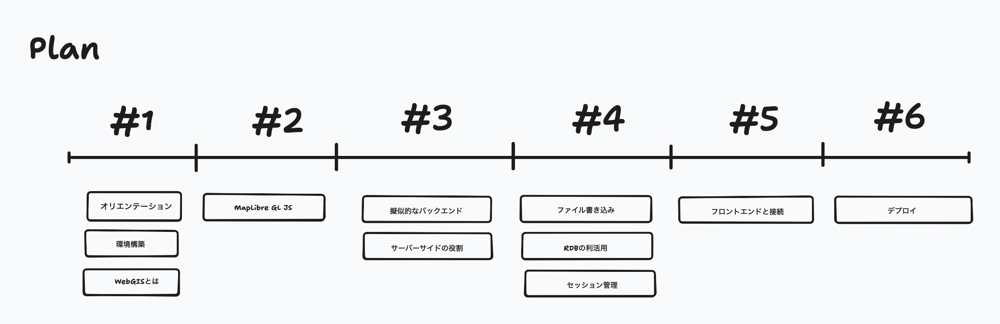
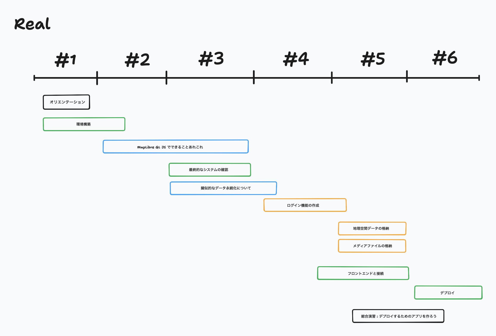

# 衛星データ解析技術研究会<br>技術セミナー（応用編）
## Webアプリケーションの開発技術の習得

第五回 2025/07/25

担当講師 : 田中聡至

---

お知らせ 1
Slackのリンク
https://join.slack.com/t/2025-qzu7873/shared_invite/zt-39hkj0z6q-8vt0qOy7h1zJ7Ug9mwM~7A

なんらかの原因で、Slackに入れなくなった方はこちらから
8/15にリンクが消失します。
(講義後はSlackのお部屋はアーカイブせずに消えるまで残す予定です。シンプルなテキストとしてバックアップはとります。)


---

お知らせ 2
https://alt9800.github.io/2025-RemoteSensingSeminar/
講義資料はスライド (pdf)だと、コードのコピペがしにくかったので、
講義資料のコードブロックが利用しやすいようにhtmlでも提供するようにしました。


---



---




---

前回のあらすじ

### ゆるいMVC
Model: データベース処理（ただしroutes内に混在しており、単一責任原則は満たさない）
View: 静的HTML + JSON API
Controller: routes以下

(そもそもExpress.js自体がroutes以下にControllerとModel両方の役割を持つ構成になる)

---

🐤前回はあまり触れませんでしたが、やったこと単位でgitにセーブポイント(commit)を追加していくとよいかも

---


```
src/
└── routes/
    ├── auth.js       # 認証コントローラー
    ├── users.js      # ユーザーコントローラー
    └── posts.js      # 投稿コントローラー
```


---

各ライブラリの役割(第5回目までの内容を補足)
```
アプリケーション
├── express (Webフレームワーク)
│   ├── cors (CORS設定)
│   ├── helmet (セキュリティヘッダー)
│   └── express-validator (入力検証)
├── 認証機能
│   ├── jsonwebtoken (トークン管理)
│   └── bcrypt (パスワード暗号化)
├── データ永続化
│   └── sqlite3 (データベース)
├── ファイル処理
│   └── multer (アップロード)
└── 設定・開発
    ├── dotenv (環境変数)
    └── nodemon (開発用)
```

---

# 投稿機能を作ろう！

---

scripts/init-db.js

```js
const sqlite3 = require('sqlite3').verbose();
const path = require('path');
const fs = require('fs');
const dotenv = require('dotenv');

// 環境変数の読み込み
dotenv.config();

// データベースディレクトリの作成
const dbDir = path.join(__dirname, '../db');
if (!fs.existsSync(dbDir)) {
  fs.mkdirSync(dbDir, { recursive: true });
}

// データベースパス
const dbPath = process.env.DB_PATH || path.join(dbDir, 'database.db');

// データベースの初期化
const db = new sqlite3.Database(dbPath);

console.log('Initializing database...');

db.serialize(() => {
  // ユーザーテーブル（既存）
  db.run(`
    CREATE TABLE IF NOT EXISTS users (
      id INTEGER PRIMARY KEY AUTOINCREMENT,
      user_id VARCHAR(50) UNIQUE NOT NULL,
      email VARCHAR(255) UNIQUE NOT NULL,
      password_hash VARCHAR(255) NOT NULL,
      created_at TIMESTAMP DEFAULT CURRENT_TIMESTAMP
    )
  `);

  // 投稿テーブル（新規追加）
  db.run(`
    CREATE TABLE IF NOT EXISTS posts (
      id INTEGER PRIMARY KEY AUTOINCREMENT,
      user_id INTEGER NOT NULL,
      latitude REAL NOT NULL,
      longitude REAL NOT NULL,
      comment TEXT,
      image_path VARCHAR(500),
      created_at TIMESTAMP DEFAULT CURRENT_TIMESTAMP,
      updated_at TIMESTAMP DEFAULT CURRENT_TIMESTAMP,
      FOREIGN KEY (user_id) REFERENCES users(id) ON DELETE CASCADE
    )
  `);

  // インデックスの作成
  db.run('CREATE INDEX IF NOT EXISTS idx_posts_user_id ON posts(user_id)');
  db.run('CREATE INDEX IF NOT EXISTS idx_posts_location ON posts(latitude, longitude)');
  db.run('CREATE INDEX IF NOT EXISTS idx_posts_created_at ON posts(created_at DESC)');

  console.log('Database initialization completed!');
});

db.close((err) => {
  if (err) {
    console.error('Error closing database:', err);
  } else {
    console.log('Database connection closed.');
  }
});
```

---

```js
node scripts/init-db.js
```


---

☝️新規追加分の投稿テーブルに注目
```js
  db.run(`
    CREATE TABLE IF NOT EXISTS posts (
      id INTEGER PRIMARY KEY AUTOINCREMENT,
      user_id INTEGER NOT NULL,
      latitude REAL NOT NULL,
      longitude REAL NOT NULL,
      comment TEXT,
      image_path VARCHAR(500),
      created_at TIMESTAMP DEFAULT CURRENT_TIMESTAMP,
      updated_at TIMESTAMP DEFAULT CURRENT_TIMESTAMP,
      FOREIGN KEY (user_id) REFERENCES users(id) ON DELETE CASCADE
    )
  `);
```

---


## 投稿関連APIの実装

### 投稿ルートの作成

`src/routes/posts.js`を新たに作る

---

`src/routes/posts.js`

```js

const express = require('express');
const multer = require('multer');
const path = require('path');
const fs = require('fs').promises;
const { body, validationResult } = require('express-validator');
const db = require('../config/db');
const { authenticateToken, optionalAuth } = require('../middleware/auth');

const router = express.Router();

// アップロードディレクトリの作成
const uploadDir = path.join(__dirname, '../../uploads');
fs.mkdir(uploadDir, { recursive: true }).catch(console.error);

// Multerの設定（1.3で詳細設定）
const storage = multer.diskStorage({
  destination: async (req, file, cb) => {
    cb(null, uploadDir);
  },
  filename: (req, file, cb) => {
    const uniqueSuffix = Date.now() + '-' + Math.round(Math.random() * 1E9);
    cb(null, uniqueSuffix + path.extname(file.originalname));
  }
});

const upload = multer({
  storage: storage,
  limits: {
    fileSize: parseInt(process.env.UPLOAD_MAX_SIZE) || 10 * 1024 * 1024 // 10MB
  },
  fileFilter: (req, file, cb) => {
    const allowedExtensions = (process.env.ALLOWED_EXTENSIONS || 'jpg,jpeg,png,gif').split(',');
    const ext = path.extname(file.originalname).toLowerCase().substring(1);
    
    if (allowedExtensions.includes(ext)) {
      cb(null, true);
    } else {
      cb(new Error('許可されていないファイル形式です'));
    }
  }
});

// 投稿一覧の取得（認証不要）
router.get('/', optionalAuth, async (req, res) => {
  try {
    const { limit = 50, offset = 0 } = req.query;
    
    const query = `
      SELECT 
        p.id,
        p.latitude,
        p.longitude,
        p.comment,
        p.image_path,
        p.created_at,
        p.user_id,
        u.user_id as username
      FROM posts p
      JOIN users u ON p.user_id = u.id
      ORDER BY p.created_at DESC
      LIMIT ? OFFSET ?
    `;
    
    const result = await db.query(query, [parseInt(limit), parseInt(offset)]);
    
    // 画像パスを完全なURLに変換
    const posts = result.rows.map(post => ({
      ...post,
      image_url: post.image_path ? `/uploads/${path.basename(post.image_path)}` : null,
      is_owner: req.user ? post.user_id === req.user.id : false
    }));
    
    res.json({
      posts,
      total: posts.length
    });
    
  } catch (error) {
    console.error('Get posts error:', error);
    res.status(500).json({ message: 'サーバーエラーが発生しました' });
  }
});

// 特定の投稿の取得
router.get('/:id', optionalAuth, async (req, res) => {
  try {
    const { id } = req.params;
    
    const query = `
      SELECT 
        p.id,
        p.latitude,
        p.longitude,
        p.comment,
        p.image_path,
        p.created_at,
        p.user_id,
        u.user_id as username
      FROM posts p
      JOIN users u ON p.user_id = u.id
      WHERE p.id = ?
    `;
    
    const result = await db.query(query, [id]);
    
    if (result.rows.length === 0) {
      return res.status(404).json({ message: '投稿が見つかりません' });
    }
    
    const post = result.rows[0];
    res.json({
      ...post,
      image_url: post.image_path ? `/uploads/${path.basename(post.image_path)}` : null,
      is_owner: req.user ? post.user_id === req.user.id : false
    });
    
  } catch (error) {
    console.error('Get post error:', error);
    res.status(500).json({ message: 'サーバーエラーが発生しました' });
  }
});

// 新規投稿の作成（認証必要）
router.post('/', authenticateToken, upload.single('image'), [
  body('latitude').isFloat({ min: -90, max: 90 }),
  body('longitude').isFloat({ min: -180, max: 180 }),
  body('comment').optional().isLength({ max: 1000 })
], async (req, res) => {
  try {
    const errors = validationResult(req);
    if (!errors.isEmpty()) {
      // アップロードされたファイルを削除
      if (req.file) {
        await fs.unlink(req.file.path).catch(console.error);
      }
      return res.status(400).json({ errors: errors.array() });
    }
    
    const { latitude, longitude, comment } = req.body;
    const imagePath = req.file ? req.file.filename : null;
    
    const query = `
      INSERT INTO posts (user_id, latitude, longitude, comment, image_path)
      VALUES (?, ?, ?, ?, ?)
    `;
    
    const result = await db.query(query, [
      req.user.id,
      parseFloat(latitude),
      parseFloat(longitude),
      comment || '',
      imagePath
    ]);
    
    const postId = result.rows[0].id;
    
    // 作成した投稿を取得
    const getPostQuery = `
      SELECT 
        p.*,
        u.user_id as username
      FROM posts p
      JOIN users u ON p.user_id = u.id
      WHERE p.id = ?
    `;
    
    const newPost = await db.query(getPostQuery, [postId]);
    const post = newPost.rows[0];
    
    res.status(201).json({
      message: '投稿が作成されました',
      post: {
        ...post,
        image_url: imagePath ? `/uploads/${imagePath}` : null,
        is_owner: true
      }
    });
    
  } catch (error) {
    console.error('Create post error:', error);
    // エラー時はアップロードされたファイルを削除
    if (req.file) {
      await fs.unlink(req.file.path).catch(console.error);
    }
    res.status(500).json({ message: 'サーバーエラーが発生しました' });
  }
});

// 投稿の更新（コメントのみ）
router.put('/:id', authenticateToken, [
  body('comment').optional().isLength({ max: 1000 })
], async (req, res) => {
  try {
    const errors = validationResult(req);
    if (!errors.isEmpty()) {
      return res.status(400).json({ errors: errors.array() });
    }
    
    const { id } = req.params;
    const { comment } = req.body;
    
    // 所有者確認
    const checkQuery = 'SELECT user_id FROM posts WHERE id = ?';
    const checkResult = await db.query(checkQuery, [id]);
    
    if (checkResult.rows.length === 0) {
      return res.status(404).json({ message: '投稿が見つかりません' });
    }
    
    if (checkResult.rows[0].user_id !== req.user.id) {
      return res.status(403).json({ message: 'この投稿を編集する権限がありません' });
    }
    
    // 更新実行
    const updateQuery = `
      UPDATE posts 
      SET comment = ?, updated_at = CURRENT_TIMESTAMP
      WHERE id = ?
    `;
    
    await db.query(updateQuery, [comment, id]);
    
    // 更新後の投稿を取得
    const getPostQuery = `
      SELECT 
        p.*,
        u.user_id as username
      FROM posts p
      JOIN users u ON p.user_id = u.id
      WHERE p.id = ?
    `;
    
    const result = await db.query(getPostQuery, [id]);
    const post = result.rows[0];
    
    res.json({
      message: '投稿が更新されました',
      post: {
        ...post,
        image_url: post.image_path ? `/uploads/${post.image_path}` : null,
        is_owner: true
      }
    });
    
  } catch (error) {
    console.error('Update post error:', error);
    res.status(500).json({ message: 'サーバーエラーが発生しました' });
  }
});

// 投稿の削除
router.delete('/:id', authenticateToken, async (req, res) => {
  try {
    const { id } = req.params;
    
    // 所有者確認と画像パスの取得
    const checkQuery = 'SELECT user_id, image_path FROM posts WHERE id = ?';
    const checkResult = await db.query(checkQuery, [id]);
    
    if (checkResult.rows.length === 0) {
      return res.status(404).json({ message: '投稿が見つかりません' });
    }
    
    if (checkResult.rows[0].user_id !== req.user.id) {
      return res.status(403).json({ message: 'この投稿を削除する権限がありません' });
    }
    
    const imagePath = checkResult.rows[0].image_path;
    
    // 削除実行
    await db.query('DELETE FROM posts WHERE id = ?', [id]);
    
    // 画像ファイルの削除
    if (imagePath) {
      const fullPath = path.join(uploadDir, imagePath);
      await fs.unlink(fullPath).catch(console.error);
    }
    
    res.json({ message: '投稿が削除されました' });
    
  } catch (error) {
    console.error('Delete post error:', error);
    res.status(500).json({ message: 'サーバーエラーが発生しました' });
  }
});

// ユーザーの投稿一覧
router.get('/user/:userId', optionalAuth, async (req, res) => {
  try {
    const { userId } = req.params;
    const { limit = 50, offset = 0 } = req.query;
    
    const query = `
      SELECT 
        p.id,
        p.latitude,
        p.longitude,
        p.comment,
        p.image_path,
        p.created_at,
        p.user_id,
        u.user_id as username
      FROM posts p
      JOIN users u ON p.user_id = u.id
      WHERE u.user_id = ?
      ORDER BY p.created_at DESC
      LIMIT ? OFFSET ?
    `;
    
    const result = await db.query(query, [userId, parseInt(limit), parseInt(offset)]);
    
    const posts = result.rows.map(post => ({
      ...post,
      image_url: post.image_path ? `/uploads/${path.basename(post.image_path)}` : null,
      is_owner: req.user ? post.user_id === req.user.id : false
    }));
    
    res.json({
      posts,
      total: posts.length
    });
    
  } catch (error) {
    console.error('Get user posts error:', error);
    res.status(500).json({ message: 'サーバーエラーが発生しました' });
  }
});

module.exports = router;
```

---

認証ミドルウェアの更新

src/middleware/auth.jsにoptionalAuthを追加：


---

```js
const jwt = require('jsonwebtoken');

const JWT_SECRET = process.env.JWT_SECRET || 'your-jwt-secret-key-change-in-production';

// JWTトークンの生成
const generateToken = (user) => {
  return jwt.sign(
    { 
      id: user.id, 
      user_id: user.user_id,
      email: user.email 
    },
    JWT_SECRET,
    { expiresIn: '7d' }
  );
};

// 認証ミドルウェア
const authenticateToken = (req, res, next) => {
  const authHeader = req.headers['authorization'];
  const token = authHeader && authHeader.split(' ')[1];

  if (!token) {
    return res.status(401).json({ message: '認証トークンが必要です' });
  }

  jwt.verify(token, JWT_SECRET, (err, user) => {
    if (err) {
      return res.status(403).json({ message: 'トークンが無効です' });
    }
    req.user = user;
    next();
  });
};

// オプショナル認証（ログインしていなくてもOK）
const optionalAuth = (req, res, next) => {
  const authHeader = req.headers['authorization'];
  const token = authHeader && authHeader.split(' ')[1];

  if (!token) {
    return next();
  }

  jwt.verify(token, JWT_SECRET, (err, user) => {
    if (!err) {
      req.user = user;
    }
    next();
  });
};

module.exports = {
  generateToken,
  authenticateToken,
  optionalAuth
};
```


---

`src/server.js`を更新して投稿ルートを追加：
```js

const express = require('express');
const path = require('path');
const helmet = require('helmet');
const cors = require('cors');
const dotenv = require('dotenv');

// 環境変数の読み込み
dotenv.config();

const app = express();
const PORT = process.env.PORT || 3000;

// ミドルウェアの設定
app.use(helmet({
  contentSecurityPolicy: false,
  crossOriginEmbedderPolicy: false,
}));

app.use(cors());
app.use(express.json());
app.use(express.urlencoded({ extended: true }));

// 静的ファイルの配信
app.use(express.static(path.join(__dirname, '../public')));
app.use('/uploads', express.static(path.join(__dirname, '../uploads')));

// ルーターのインポート
const authRoutes = require('./routes/auth');
const usersRoutes = require('./routes/users');
const postsRoutes = require('./routes/posts');  // 追加

// APIルートの設定
app.use('/api/auth', authRoutes);
app.use('/api/users', usersRoutes);
app.use('/api/posts', postsRoutes);  // 追加

// エラーハンドリング
app.use((err, req, res, next) => {
  console.error('Error:', err.stack);
  res.status(err.status || 500).json({
    message: err.message || 'Internal Server Error',
    ...(process.env.NODE_ENV === 'development' && { stack: err.stack })
  });
});

// 404ハンドラー
app.use((req, res) => {
  res.status(404).json({ message: 'Not Found' });
});

// サーバー起動
app.listen(PORT, () => {
  console.log(`Server is running on port ${PORT}`);
  console.log(`Environment: ${process.env.NODE_ENV}`);
});
```

---

.envファイルに以下を追加：

```sh
# アップロード設定
UPLOAD_MAX_SIZE=10485760  # 10MB
ALLOWED_EXTENSIONS=jpg,jpeg,png,gif
```

概ねよくやる設定です。

---

```sh
mkdir -p uploads
#gitを使う人は下も
touch uploads/.gitkeep
```

---

## ここで一旦テスト

1. データベースの再初期化
```sh
node scripts/init-db.js
```
2. サーバーの起動
```sh
npm run dev
```
3. APIテスト（curl）

投稿一覧の取得（認証不要）: GETなのでブラウザでも...
```sh
curl http://localhost:3000/api/posts
#> {"posts":[],"total":0}
```

---
テスト投稿

```sh
# まずログイン
TOKEN=$(curl -s -X POST http://localhost:3000/api/auth/login \
  -H "Content-Type: application/json" \
  -d '{"user_id": "testuser", "password": "password123"}' \
  | grep -o '"token":"[^"]*' | grep -o '[^"]*$')
```

(Q.JWTはブラウザだとどこに持たれるか？ A. localstorage)

```sh
# 投稿作成（画像なし）
curl -X POST http://localhost:3000/api/posts \
  -H "Authorization: Bearer $TOKEN" \
  -H "Content-Type: application/json" \
  -d '{
    "latitude": 33.9980,
    "longitude": 131.2463,
    "comment": "テスト投稿です"
  }'
```

---

```sh
# 投稿作成（画像付き）
curl -X POST http://localhost:3000/api/posts \
  -H "Authorization: Bearer $TOKEN" \
  -F "latitude=33.9980" \
  -F "longitude=131.2463" \
  -F "comment=画像付き投稿" \
  -F "image=@/path/to/test.jpg"
```


---
GETリクエスト比較

### 方法1: URLに直接パラメータ
```sh
curl -X GET "https://example.com/api/users?name=John&age=30&city=Tokyo"
```

### 方法2: -Gオプションと--data-urlencode
```sh
curl -G https://example.com/api/users \
     -d "name=John" \
     -d "age=30" \
     -d "city=Tokyo"
(スマホからリクエストしてもいいかも)
```

---

# CRUD

☝️作成したエンドポイントの動作を確認してみましょう

---

```
┌─────────────────────────────────────────────┐
│                   users                      │
├─────────────────────────────────────────────┤
│ PK │ id              │ INTEGER    │ AI      │
│    │ user_id         │ VARCHAR(50)│ UNIQUE  │
│    │ email           │ VARCHAR(255)│ UNIQUE │
│    │ password_hash   │ VARCHAR(255)│        │
│    │ created_at      │ TIMESTAMP  │ DEFAULT │
└─────────────────────────────────────────────┘
                          │
                          │ 1
                          │
                          │
                          │ *
┌─────────────────────────────────────────────┐
│                   posts                      │
├─────────────────────────────────────────────┤
│ PK │ id              │ INTEGER    │ AI      │
│ FK │ user_id         │ INTEGER    │ NOT NULL│
│    │ latitude        │ REAL       │ NOT NULL│
│    │ longitude       │ REAL       │ NOT NULL│
│    │ comment         │ TEXT       │         │
│    │ image_path      │ VARCHAR(500)│        │
│    │ created_at      │ TIMESTAMP  │ DEFAULT │
│    │ updated_at      │ TIMESTAMP  │ DEFAULT │
└─────────────────────────────────────────────┘

```


---

### 特定の投稿を取得
```sh
curl http://localhost:3000/api/posts/1
```
### 投稿の更新
```sh
curl -X PUT http://localhost:3000/api/posts/1 \
  -H "Authorization: Bearer $TOKEN" \
  -H "Content-Type: application/json" \
  -d '{"comment": "更新されたコメント"}
```
### 投稿の削除
```sh
curl -X DELETE http://localhost:3000/api/posts/1 \
  -H "Authorization: Bearer $TOKEN"
```
### ユーザー別投稿一覧
```sh
curl http://localhost:3000/api/posts/user/testuser
```

---

ここまでやったこと

1. データベーススキーマの拡張

postsテーブルの追加
必要なインデックスの設定
外部キー制約の設定

2. 投稿関連API（6つ）

GET /api/posts - 投稿一覧（認証不要）
GET /api/posts/:id - 特定投稿の取得
POST /api/posts - 新規投稿（認証必要）
PUT /api/posts/:id - 投稿更新（認証必要）
DELETE /api/posts/:id - 投稿削除（認証必要）
GET /api/posts/user/:userId - ユーザー別一覧

3. 画像アップロード機能

multerによるファイルアップロード
10MBのサイズ制限
jpg, jpeg, png, gif形式のみ許可
ユニークなファイル名生成

---

# フロントエンド(View)の作成

---

## まずは地図機能以外の部分のViewを。


### 1. HTMLページ（4つ）

index.html - メインページ（地図と投稿一覧）
login/index.html - ログインページ
signup/index.html - サインアップページ
mypage/index.html - マイページ

### 2. JavaScript機能

common.js - 共通関数（認証トークン管理、日付フォーマット等）
auth.js - 認証関連（ログイン、サインアップ、トークン検証）
map.js - 地図機能の暫定版（投稿一覧の表示のみ）
mypage.js - マイページ機能


---

`public/index.html` : （メインページ）

```html
<!DOCTYPE html>
<html lang="ja">
<head>
    <meta charset="UTF-8">
    <meta name="viewport" content="width=device-width, initial-scale=1.0">
    <title>フィールド調査システム</title>
    
    <!-- MapLibre GL JS -->
    <link href="https://unpkg.com/maplibre-gl@3.6.2/dist/maplibre-gl.css" rel="stylesheet" />
    <script src="https://unpkg.com/maplibre-gl@3.6.2/dist/maplibre-gl.js"></script>
    
    <!-- 共通スタイル -->
    <link rel="stylesheet" href="/css/style.css">
</head>
<body>
    <!-- ヘッダー -->
    <header class="header">
        <div class="header-container">
            <h1 class="header-title">
                <a href="/">フィールド調査システム</a>
            </h1>
            <nav class="header-nav">
                <div id="nav-not-logged-in" class="nav-group" style="display: none;">
                    <a href="/login/" class="btn btn-outline">ログイン</a>
                    <a href="/signup/" class="btn btn-primary">サインアップ</a>
                </div>
                <div id="nav-logged-in" class="nav-group" style="display: none;">
                    <span class="username" id="current-username"></span>
                    <a href="/mypage/" class="btn btn-outline">マイページ</a>
                    <button id="logout-btn" class="btn btn-danger">ログアウト</button>
                </div>
            </nav>
        </div>
    </header>

    <!-- メインコンテンツ -->
    <main class="main-container">
        <!-- 地図エリア -->
        <div id="map" class="map-container"></div>
        
        <!-- サイドパネル -->
        <aside class="side-panel">
            <h2>投稿一覧</h2>
            <div id="posts-list" class="posts-list">
                <p class="loading">読み込み中...</p>
            </div>
        </aside>
    </main>

    <!-- 投稿モーダル -->
    <div id="post-modal" class="modal" style="display: none;">
        <div class="modal-content">
            <span class="modal-close">&times;</span>
            <h2>新規投稿</h2>
            <form id="post-form">
                <div class="form-group">
                    <label>位置情報</label>
                    <p>緯度: <span id="modal-lat"></span></p>
                    <p>経度: <span id="modal-lng"></span></p>
                </div>
                
                <div class="form-group">
                    <label for="post-comment">コメント</label>
                    <textarea id="post-comment" rows="4" maxlength="1000" placeholder="場所の説明や観察内容を入力してください"></textarea>
                </div>
                
                <div class="form-group">
                    <label for="post-image">画像</label>
                    <input type="file" id="post-image" accept="image/jpeg,image/jpg,image/png,image/gif">
                    <div id="image-preview" class="image-preview"></div>
                </div>
                
                <div class="form-actions">
                    <button type="button" class="btn btn-outline" id="cancel-post">キャンセル</button>
                    <button type="submit" class="btn btn-primary">投稿する</button>
                </div>
            </form>
        </div>
    </div>

    <!-- 共通スクリプト -->
    <script src="/js/common.js"></script>
    <script src="/js/auth.js"></script>
    <script src="/js/map.js"></script>
</body>
</html>
```


---

`public/login/index.html``` : （ログインページ）

```html
<!DOCTYPE html>
<html lang="ja">
<head>
    <meta charset="UTF-8">
    <meta name="viewport" content="width=device-width, initial-scale=1.0">
    <title>ログイン - フィールド調査システム</title>
    <link rel="stylesheet" href="/css/style.css">
    <style>
        .auth-container {
            min-height: 100vh;
            display: flex;
            align-items: center;
            justify-content: center;
            background-color: #f5f5f5;
        }
        
        .auth-box {
            background: white;
            padding: 2rem;
            border-radius: 0.5rem;
            box-shadow: 0 4px 6px rgba(0, 0, 0, 0.1);
            width: 100%;
            max-width: 400px;
        }
        
        .auth-title {
            font-size: 1.5rem;
            font-weight: bold;
            text-align: center;
            margin-bottom: 2rem;
        }
        
        .auth-link {
            text-align: center;
            margin-top: 1rem;
            color: #6b7280;
        }
        
        .auth-link a {
            color: #2563eb;
            text-decoration: none;
        }
        
        .auth-link a:hover {
            text-decoration: underline;
        }
    </style>
</head>
<body>
    <!-- ヘッダー -->
    <header class="header">
        <div class="header-container">
            <h1 class="header-title">
                <a href="/">フィールド調査システム</a>
            </h1>
            <nav class="header-nav">
                <div id="nav-not-logged-in" class="nav-group">
                    <a href="/login/" class="btn btn-outline">ログイン</a>
                    <a href="/signup/" class="btn btn-primary">サインアップ</a>
                </div>
            </nav>
        </div>
    </header>

    <!-- ログインフォーム -->
    <div class="auth-container">
        <div class="auth-box">
            <h2 class="auth-title">ログイン</h2>
            
            <form id="login-form">
                <div class="form-group">
                    <label for="user-id">ユーザーID</label>
                    <input type="text" id="user-id" required autofocus>
                </div>
                
                <div class="form-group">
                    <label for="password">パスワード</label>
                    <input type="password" id="password" required>
                </div>
                
                <div class="form-group">
                    <button type="submit" class="btn btn-primary" style="width: 100%;">ログイン</button>
                </div>
            </form>
            
            <div class="auth-link">
                アカウントをお持ちでない方は <a href="/signup/">サインアップ</a>
            </div>
        </div>
    </div>

    <script src="/js/common.js"></script>
    <script src="/js/auth.js"></script>
    <script>
        document.getElementById('login-form').addEventListener('submit', async (e) => {
            e.preventDefault();
            
            const userId = document.getElementById('user-id').value;
            const password = document.getElementById('password').value;
            const submitButton = e.target.querySelector('button[type="submit"]');
            
            // ボタンを無効化
            submitButton.disabled = true;
            submitButton.textContent = 'ログイン中...';
            
            const result = await login(userId, password);
            
            if (result.success) {
                window.location.href = '/';
            } else {
                showError(result.error, e.target);
                submitButton.disabled = false;
                submitButton.textContent = 'ログイン';
            }
        });
    </script>
</body>
</html>
```


---

`public/signup/index.html`:（サインアップページ）

```html
<!DOCTYPE html>
<html lang="ja">
<head>
    <meta charset="UTF-8">
    <meta name="viewport" content="width=device-width, initial-scale=1.0">
    <title>サインアップ - フィールド調査システム</title>
    <link rel="stylesheet" href="/css/style.css">
    <style>
        .auth-container {
            min-height: 100vh;
            display: flex;
            align-items: center;
            justify-content: center;
            background-color: #f5f5f5;
        }
        
        .auth-box {
            background: white;
            padding: 2rem;
            border-radius: 0.5rem;
            box-shadow: 0 4px 6px rgba(0, 0, 0, 0.1);
            width: 100%;
            max-width: 400px;
        }
        
        .auth-title {
            font-size: 1.5rem;
            font-weight: bold;
            text-align: center;
            margin-bottom: 2rem;
        }
        
        .auth-link {
            text-align: center;
            margin-top: 1rem;
            color: #6b7280;
        }
        
        .auth-link a {
            color: #2563eb;
            text-decoration: none;
        }
        
        .auth-link a:hover {
            text-decoration: underline;
        }
        
        .help-text {
            font-size: 0.875rem;
            color: #6b7280;
            margin-top: 0.25rem;
        }
    </style>
</head>
<body>
    <!-- ヘッダー -->
    <header class="header">
        <div class="header-container">
            <h1 class="header-title">
                <a href="/">フィールド調査システム</a>
            </h1>
            <nav class="header-nav">
                <div id="nav-not-logged-in" class="nav-group">
                    <a href="/login/" class="btn btn-outline">ログイン</a>
                    <a href="/signup/" class="btn btn-primary">サインアップ</a>
                </div>
            </nav>
        </div>
    </header>

    <!-- サインアップフォーム -->
    <div class="auth-container">
        <div class="auth-box">
            <h2 class="auth-title">サインアップ</h2>
            
            <form id="signup-form">
                <div class="form-group">
                    <label for="email">メールアドレス</label>
                    <input type="email" id="email" required autofocus>
                </div>
                
                <div class="form-group">
                    <label for="user-id">ユーザーID</label>
                    <input type="text" id="user-id" required pattern="[a-zA-Z0-9_-]{3,}" title="3文字以上の英数字、ハイフン、アンダースコアのみ">
                    <p class="help-text">3文字以上の英数字、ハイフン(-)、アンダースコア(_)が使用できます</p>
                </div>
                
                <div class="form-group">
                    <label for="password">パスワード</label>
                    <input type="password" id="password" required minlength="6">
                    <p class="help-text">6文字以上で設定してください</p>
                </div>
                
                <div class="form-group">
                    <label for="password-confirm">パスワード（確認）</label>
                    <input type="password" id="password-confirm" required minlength="6">
                </div>
                
                <div class="form-group">
                    <button type="submit" class="btn btn-primary" style="width: 100%;">アカウント作成</button>
                </div>
            </form>
            
            <div class="auth-link">
                既にアカウントをお持ちの方は <a href="/login/">ログイン</a>
            </div>
        </div>
    </div>

    <script src="/js/common.js"></script>
    <script src="/js/auth.js"></script>
    <script>
        document.getElementById('signup-form').addEventListener('submit', async (e) => {
            e.preventDefault();
            
            const email = document.getElementById('email').value;
            const userId = document.getElementById('user-id').value;
            const password = document.getElementById('password').value;
            const passwordConfirm = document.getElementById('password-confirm').value;
            const submitButton = e.target.querySelector('button[type="submit"]');
            
            // パスワード確認
            if (password !== passwordConfirm) {
                showError('パスワードが一致しません', e.target);
                return;
            }
            
            // ボタンを無効化
            submitButton.disabled = true;
            submitButton.textContent = '作成中...';
            
            const result = await signup(email, userId, password);
            
            if (result.success) {
                showSuccess('アカウントが作成されました！');
                setTimeout(() => {
                    window.location.href = '/';
                }, 1000);
            } else {
                showError(result.error, e.target);
                submitButton.disabled = false;
                submitButton.textContent = 'アカウント作成';
            }
        });
    </script>
</body>
</html>

```


---

`public/mypage/index.html`:（マイページ）

```html
<!DOCTYPE html>
<html lang="ja">
<head>
    <meta charset="UTF-8">
    <meta name="viewport" content="width=device-width, initial-scale=1.0">
    <title>マイページ - フィールド調査システム</title>
    <link rel="stylesheet" href="/css/style.css">
    <style>
        .mypage-container {
            max-width: 1200px;
            margin: 2rem auto;
            padding: 0 1rem;
        }
        
        .user-info {
            background: white;
            padding: 2rem;
            border-radius: 0.5rem;
            box-shadow: 0 2px 4px rgba(0, 0, 0, 0.1);
            margin-bottom: 2rem;
        }
        
        .user-stats {
            display: grid;
            grid-template-columns: repeat(auto-fit, minmax(200px, 1fr));
            gap: 1rem;
            margin-top: 1rem;
        }
        
        .stat-card {
            background: #f3f4f6;
            padding: 1rem;
            border-radius: 0.375rem;
            text-align: center;
        }
        
        .stat-value {
            font-size: 2rem;
            font-weight: bold;
            color: #2563eb;
        }
        
        .stat-label {
            color: #6b7280;
            font-size: 0.875rem;
        }
        
        .my-posts {
            background: white;
            padding: 2rem;
            border-radius: 0.5rem;
            box-shadow: 0 2px 4px rgba(0, 0, 0, 0.1);
        }
        
        .posts-grid {
            display: grid;
            grid-template-columns: repeat(auto-fill, minmax(300px, 1fr));
            gap: 1.5rem;
            margin-top: 1.5rem;
        }
        
        .post-card {
            border: 1px solid #e5e7eb;
            border-radius: 0.5rem;
            overflow: hidden;
            transition: all 0.2s;
        }
        
        .post-card:hover {
            box-shadow: 0 4px 12px rgba(0, 0, 0, 0.1);
        }
        
        .post-image {
            width: 100%;
            height: 200px;
            object-fit: cover;
            background-color: #f3f4f6;
        }
        
        .post-content {
            padding: 1rem;
        }
        
        .post-actions {
            display: flex;
            gap: 0.5rem;
            margin-top: 1rem;
        }
        
        .btn-small {
            padding: 0.25rem 0.75rem;
            font-size: 0.875rem;
        }
    </style>
</head>
<body>
    <!-- ヘッダー -->
    <header class="header">
        <div class="header-container">
            <h1 class="header-title">
                <a href="/">フィールド調査システム</a>
            </h1>
            <nav class="header-nav">
                <div id="nav-not-logged-in" class="nav-group" style="display: none;">
                    <a href="/login/" class="btn btn-outline">ログイン</a>
                    <a href="/signup/" class="btn btn-primary">サインアップ</a>
                </div>
                <div id="nav-logged-in" class="nav-group" style="display: none;">
                    <span class="username" id="current-username"></span>
                    <a href="/mypage/" class="btn btn-outline">マイページ</a>
                    <button id="logout-btn" class="btn btn-danger">ログアウト</button>
                </div>
            </nav>
        </div>
    </header>

    <!-- マイページコンテンツ -->
    <div class="mypage-container">
        <!-- ユーザー情報 -->
        <div class="user-info">
            <h2>ユーザー情報</h2>
            <div id="user-details">
                <p class="loading">読み込み中...</p>
            </div>
        </div>

        <!-- 自分の投稿 -->
        <div class="my-posts">
            <h2>投稿一覧</h2>
            <div id="my-posts-grid" class="posts-grid">
                <p class="loading">読み込み中...</p>
            </div>
        </div>
    </div>

    <script src="/js/common.js"></script>
    <script src="/js/auth.js"></script>
    <script src="/js/mypage.js"></script>
</body>
</html>
```


---


JS部分を作っていきます。
サンプルで提示したものと異なって、
共通かできる部品が多くあるので、これを繰り返し使えるように切り出していきます。
また、それに伴って、特定のページでしか使わないコードも単一のJSファイルとして切り出します。

---

```sh
mkdir -p public/{login,signup,mypage,js,css}
```

---

`public/js/common.js`

```js
// 共通関数とユーティリティ

// API のベースURL
const API_BASE_URL = '/api';

// ローカルストレージのキー
const TOKEN_KEY = 'auth_token';
const USER_KEY = 'user_info';

// 認証トークンの取得
function getAuthToken() {
    return localStorage.getItem(TOKEN_KEY);
}

// 認証トークンの保存
function setAuthToken(token) {
    localStorage.setItem(TOKEN_KEY, token);
}

// 認証トークンの削除
function removeAuthToken() {
    localStorage.removeItem(TOKEN_KEY);
    localStorage.removeItem(USER_KEY);
}

// ユーザー情報の取得
function getUserInfo() {
    const userStr = localStorage.getItem(USER_KEY);
    return userStr ? JSON.parse(userStr) : null;
}

// ユーザー情報の保存
function setUserInfo(user) {
    localStorage.setItem(USER_KEY, JSON.stringify(user));
}

// APIリクエストのヘッダー生成
function getAuthHeaders() {
    const token = getAuthToken();
    const headers = {
        'Content-Type': 'application/json',
    };
    
    if (token) {
        headers['Authorization'] = `Bearer ${token}`;
    }
    
    return headers;
}

// 日付フォーマット
function formatDate(dateString) {
    const date = new Date(dateString);
    const now = new Date();
    const diff = now - date;
    
    // 1分以内
    if (diff < 60000) {
        return 'たった今';
    }
    // 1時間以内
    if (diff < 3600000) {
        const minutes = Math.floor(diff / 60000);
        return `${minutes}分前`;
    }
    // 24時間以内
    if (diff < 86400000) {
        const hours = Math.floor(diff / 3600000);
        return `${hours}時間前`;
    }
    // 7日以内
    if (diff < 604800000) {
        const days = Math.floor(diff / 86400000);
        return `${days}日前`;
    }
    
    // それ以外は日付表示
    return date.toLocaleDateString('ja-JP');
}

// エラーメッセージの表示
function showError(message, targetElement) {
    const errorDiv = document.createElement('div');
    errorDiv.className = 'error';
    errorDiv.textContent = message;
    
    if (targetElement) {
        // 既存のエラーメッセージを削除
        const existingError = targetElement.querySelector('.error');
        if (existingError) {
            existingError.remove();
        }
        targetElement.appendChild(errorDiv);
        
        // 5秒後に自動削除
        setTimeout(() => {
            errorDiv.remove();
        }, 5000);
    } else {
        alert(message);
    }
}

// 成功メッセージの表示
function showSuccess(message, targetElement) {
    const successDiv = document.createElement('div');
    successDiv.className = 'success';
    successDiv.textContent = message;
    
    if (targetElement) {
        // 既存のメッセージを削除
        const existingMessage = targetElement.querySelector('.success, .error');
        if (existingMessage) {
            existingMessage.remove();
        }
        targetElement.appendChild(successDiv);
        
        // 3秒後に自動削除
        setTimeout(() => {
            successDiv.remove();
        }, 3000);
    } else {
        alert(message);
    }
}

// ヘッダーナビゲーションの更新
function updateNavigation() {
    const notLoggedIn = document.getElementById('nav-not-logged-in');
    const loggedIn = document.getElementById('nav-logged-in');
    const usernameSpan = document.getElementById('current-username');
    
    // 要素が存在しない場合は早期リターン
    if (!notLoggedIn || !loggedIn) {
        console.warn('Navigation elements not found');
        return;
    }
    
    const user = getUserInfo();
    
    if (user) {
        // ログイン済み
        notLoggedIn.style.display = 'none';
        loggedIn.style.display = 'flex';
        if (usernameSpan) {
            usernameSpan.textContent = user.user_id;
        }
    } else {
        // 未ログイン
        notLoggedIn.style.display = 'flex';
        loggedIn.style.display = 'none';
    }
}

// HTMLエスケープ
function escapeHtml(str) {
    const div = document.createElement('div');
    div.textContent = str;
    return div.innerHTML;
}

// ページ読み込み時の初期化
document.addEventListener('DOMContentLoaded', () => {
    updateNavigation();
    
    // ログアウトボタンのイベント
    const logoutBtn = document.getElementById('logout-btn');
    if (logoutBtn) {
        logoutBtn.addEventListener('click', () => {
            if (confirm('ログアウトしますか？')) {
                removeAuthToken();
                window.location.href = '/';
            }
        });
    }
});
```

---

`public/js/auth.js`

```js

// 認証関連の関数

// ログインチェックと認証が必要なページでのリダイレクト
function requireAuth() {
    const token = getAuthToken();
    if (!token) {
        window.location.href = '/login/';
        return false;
    }
    return true;
}

// トークンの検証
async function verifyToken() {
    const token = getAuthToken();
    if (!token) return false;
    
    try {
        const response = await fetch(`${API_BASE_URL}/auth/verify`, {
            headers: {
                'Authorization': `Bearer ${token}`
            }
        });
        
        if (response.ok) {
            const data = await response.json();
            return data.valid;
        }
        
        // トークンが無効な場合はクリア
        removeAuthToken();
        return false;
    } catch (error) {
        console.error('Token verification error:', error);
        return false;
    }
}

// ログイン処理
async function login(userId, password) {
    try {
        const response = await fetch(`${API_BASE_URL}/auth/login`, {
            method: 'POST',
            headers: {
                'Content-Type': 'application/json',
            },
            body: JSON.stringify({
                user_id: userId,
                password: password
            })
        });
        
        const data = await response.json();
        
        if (response.ok) {
            setAuthToken(data.token);
            setUserInfo(data.user);
            return { success: true };
        } else {
            return { success: false, error: data.message || 'ログインに失敗しました' };
        }
    } catch (error) {
        console.error('Login error:', error);
        return { success: false, error: 'ネットワークエラーが発生しました' };
    }
}

// サインアップ処理
async function signup(email, userId, password) {
    try {
        const response = await fetch(`${API_BASE_URL}/auth/signup`, {
            method: 'POST',
            headers: {
                'Content-Type': 'application/json',
            },
            body: JSON.stringify({
                email: email,
                user_id: userId,
                password: password
            })
        });
        
        const data = await response.json();
        
        if (response.ok) {
            setAuthToken(data.token);
            setUserInfo(data.user);
            return { success: true };
        } else {
            // バリデーションエラーの処理
            if (data.errors) {
                const errorMessages = data.errors.map(err => err.msg).join('\n');
                return { success: false, error: errorMessages };
            }
            return { success: false, error: data.message || 'サインアップに失敗しました' };
        }
    } catch (error) {
        console.error('Signup error:', error);
        return { success: false, error: 'ネットワークエラーが発生しました' };
    }
}

// ユーザー情報の取得
async function fetchUserInfo() {
    try {
        const response = await fetch(`${API_BASE_URL}/users/me`, {
            headers: getAuthHeaders()
        });
        
        if (response.ok) {
            const data = await response.json();
            setUserInfo(data.user);
            return data.user;
        }
        
        return null;
    } catch (error) {
        console.error('Fetch user info error:', error);
        return null;
    }
}
```

---

CSSについても同様に切り出しておき、共通カタログ(コレクション)として作っておいて、書くhtmlから必要な部分だけ利用するようにします。

```css
/* リセットとベース設定 */
* {
    margin: 0;
    padding: 0;
    box-sizing: border-box;
}

body {
    font-family: -apple-system, BlinkMacSystemFont, 'Segoe UI', Roboto, sans-serif;
    line-height: 1.6;
    color: #333;
    background-color: #f5f5f5;
}

/* ヘッダー */
.header {
    background-color: #fff;
    box-shadow: 0 2px 4px rgba(0,0,0,0.1);
    position: sticky;
    top: 0;
    z-index: 1000;
}

.header-container {
    max-width: 1400px;
    margin: 0 auto;
    padding: 1rem 2rem;
    display: flex;
    justify-content: space-between;
    align-items: center;
}

.header-title {
    font-size: 1.5rem;
    font-weight: bold;
}

.header-title a {
    color: #2563eb;
    text-decoration: none;
}

.header-nav {
    display: flex;
    align-items: center;
    gap: 1rem;
}

.nav-group {
    display: flex;
    align-items: center;
    gap: 1rem;
}

.username {
    font-weight: 500;
    color: #666;
}

/* ボタン */
.btn {
    padding: 0.5rem 1rem;
    border: none;
    border-radius: 0.375rem;
    font-size: 0.875rem;
    font-weight: 500;
    cursor: pointer;
    text-decoration: none;
    display: inline-block;
    transition: all 0.2s;
}

.btn-primary {
    background-color: #2563eb;
    color: white;
}

.btn-primary:hover {
    background-color: #1d4ed8;
}

.btn-outline {
    background-color: white;
    color: #2563eb;
    border: 1px solid #2563eb;
}

.btn-outline:hover {
    background-color: #eff6ff;
}

.btn-danger {
    background-color: #dc2626;
    color: white;
}

.btn-danger:hover {
    background-color: #b91c1c;
}

/* メインコンテナ */
.main-container {
    display: flex;
    height: calc(100vh - 80px);
    position: relative;
}

/* 地図 */
.map-container {
    flex: 1;
    position: relative;
}

/* サイドパネル */
.side-panel {
    width: 400px;
    background-color: white;
    box-shadow: -2px 0 4px rgba(0,0,0,0.1);
    overflow-y: auto;
    padding: 1.5rem;
}

.side-panel h2 {
    font-size: 1.25rem;
    margin-bottom: 1rem;
}

/* 投稿リスト */
.posts-list {
    display: flex;
    flex-direction: column;
    gap: 1rem;
}

.post-item {
    padding: 1rem;
    border: 1px solid #e5e7eb;
    border-radius: 0.5rem;
    cursor: pointer;
    transition: all 0.2s;
}

.post-item:hover {
    box-shadow: 0 2px 8px rgba(0,0,0,0.1);
}

.post-item.selected {
    border-color: #2563eb;
    background-color: #eff6ff;
    box-shadow: 0 0 0 2px rgba(37, 99, 235, 0.2);
}

.post-header {
    display: flex;
    justify-content: space-between;
    margin-bottom: 0.5rem;
}

.post-user {
    font-weight: 500;
    color: #2563eb;
}

.post-date {
    font-size: 0.875rem;
    color: #6b7280;
}

.post-comment {
    margin-bottom: 0.5rem;
    word-wrap: break-word;
}

.post-image {
    width: 100%;
    height: 200px;
    object-fit: cover;
    border-radius: 0.375rem;
}

.loading {
    text-align: center;
    color: #6b7280;
}

/* モーダル */
.modal {
    position: fixed;
    top: 0;
    left: 0;
    width: 100%;
    height: 100%;
    background-color: rgba(0,0,0,0.5);
    display: flex;
    align-items: center;
    justify-content: center;
    z-index: 2000;
}

.modal-content {
    background-color: white;
    padding: 2rem;
    border-radius: 0.5rem;
    max-width: 500px;
    width: 90%;
    max-height: 90vh;
    overflow-y: auto;
    position: relative;
}

.modal-close {
    position: absolute;
    top: 1rem;
    right: 1rem;
    font-size: 1.5rem;
    cursor: pointer;
    color: #6b7280;
}

.modal-close:hover {
    color: #374151;
}

/* フォーム */
.form-group {
    margin-bottom: 1.5rem;
}

.form-group label {
    display: block;
    margin-bottom: 0.5rem;
    font-weight: 500;
}

.form-group input[type="text"],
.form-group input[type="email"],
.form-group input[type="password"],
.form-group textarea {
    width: 100%;
    padding: 0.5rem;
    border: 1px solid #d1d5db;
    border-radius: 0.375rem;
    font-size: 1rem;
}

.form-group textarea {
    resize: vertical;
}

.form-actions {
    display: flex;
    gap: 1rem;
    justify-content: flex-end;
}

.image-preview {
    margin-top: 1rem;
}

.image-preview img {
    max-width: 100%;
    max-height: 300px;
    border-radius: 0.375rem;
}

/* エラーメッセージ */
.error {
    color: #dc2626;
    font-size: 0.875rem;
    margin-top: 0.25rem;
}

.success {
    color: #059669;
    font-size: 0.875rem;
    margin-top: 0.25rem;
}

/* レスポンシブ */
@media (max-width: 768px) {
    .main-container {
        flex-direction: column;
    }
    
    .side-panel {
        width: 100%;
        height: 300px;
        box-shadow: 0 -2px 4px rgba(0,0,0,0.1);
    }
    
    .header-container {
        padding: 1rem;
    }
    
    .modal-content {
        padding: 1.5rem;
    }
}
```


---

`public/js/map.js`
```js
// 地図関連の機能（Phase 3で完全実装）

let map;
let posts = [];

// 地図の初期化（暫定）
function initMap() {
    // Phase 3で実装
    console.log('Map will be initialized in Phase 3');
    
    // とりあえず投稿一覧だけ読み込む
    loadPosts();
}

// 投稿の読み込み
async function loadPosts() {
    try {
        const response = await fetch(`${API_BASE_URL}/posts`);
        const data = await response.json();
        
        if (response.ok) {
            posts = data.posts;
            displayPosts(data.posts);
        }
    } catch (error) {
        console.error('Load posts error:', error);
        showError('投稿の読み込みに失敗しました');
    }
}

// 投稿一覧の表示
function displayPosts(posts) {
    const postsList = document.getElementById('posts-list');
    
    if (!postsList) return;
    
    if (posts.length === 0) {
        postsList.innerHTML = '<p class="loading">投稿がありません</p>';
        return;
    }
    
    postsList.innerHTML = posts.map(post => `
        <div class="post-item" data-post-id="${post.id}">
            <div class="post-header">
                <span class="post-user">${escapeHtml(post.username)}</span>
                <span class="post-date">${formatDate(post.created_at)}</span>
            </div>
            ${post.comment ? `<p class="post-comment">${escapeHtml(post.comment)}</p>` : ''}
            ${post.image_url ? `` : ''}
        </div>
    `).join('');
}

// ページ読み込み時
document.addEventListener('DOMContentLoaded', () => {
    if (document.getElementById('map')) {
        initMap();
    }
});
```


---

`public/js/mypage.js`

```js
// マイページ機能

// 認証チェック
if (!requireAuth()) {
    // requireAuth内でリダイレクトされる
}

// ユーザー情報の読み込み
async function loadUserInfo() {
    try {
        const [userResponse, statsResponse] = await Promise.all([
            fetch(`${API_BASE_URL}/users/me`, { headers: getAuthHeaders() }),
            fetch(`${API_BASE_URL}/users/me/stats`, { headers: getAuthHeaders() })
        ]);

        if (userResponse.ok && statsResponse.ok) {
            const userData = await userResponse.json();
            const statsData = await statsResponse.json();
            
            displayUserInfo(userData.user, statsData.stats);
        }
    } catch (error) {
        console.error('Load user info error:', error);
        showError('ユーザー情報の読み込みに失敗しました');
    }
}

// ユーザー情報の表示
function displayUserInfo(user, stats) {
    const userDetails = document.getElementById('user-details');
    userDetails.innerHTML = `
        <p><strong>ユーザーID:</strong> ${user.user_id}</p>
        <p><strong>メールアドレス:</strong> ${user.email}</p>
        <p><strong>登録日:</strong> ${new Date(user.created_at).toLocaleDateString('ja-JP')}</p>
        
        <div class="user-stats">
            <div class="stat-card">
                <div class="stat-value">${stats.total_posts}</div>
                <div class="stat-label">総投稿数</div>
            </div>
            <div class="stat-card">
                <div class="stat-value">${stats.posts_with_images}</div>
                <div class="stat-label">画像付き投稿</div>
            </div>
        </div>
    `;
}

// 自分の投稿の読み込み
async function loadMyPosts() {
    try {
        const user = getUserInfo();
        const response = await fetch(`${API_BASE_URL}/posts/user/${user.user_id}`, {
            headers: getAuthHeaders()
        });

        if (response.ok) {
            const data = await response.json();
            displayMyPosts(data.posts);
        }
    } catch (error) {
        console.error('Load my posts error:', error);
        showError('投稿の読み込みに失敗しました');
    }
}

// 投稿の表示
function displayMyPosts(posts) {
    const postsGrid = document.getElementById('my-posts-grid');
    
    if (posts.length === 0) {
        postsGrid.innerHTML = '<p>まだ投稿がありません</p>';
        return;
    }

    postsGrid.innerHTML = posts.map(post => `
        <div class="post-card" data-post-id="${post.id}">
            ${post.image_url ? 
                `` : 
                '<div class="post-image" style="display: flex; align-items: center; justify-content: center; color: #9ca3af;">画像なし</div>'
            }
            <div class="post-content">
                <p class="post-date">${formatDate(post.created_at)}</p>
                <p class="post-comment">${escapeHtml(post.comment || '（コメントなし）')}</p>
                <p style="font-size: 0.875rem; color: #6b7280;">
                    緯度: ${post.latitude.toFixed(6)}, 経度: ${post.longitude.toFixed(6)}
                </p>
                <div class="post-actions">
                    <button class="btn btn-outline btn-small" onclick="viewOnMap(${post.latitude}, ${post.longitude})">
                        地図で見る
                    </button>
                    <button class="btn btn-danger btn-small" onclick="deletePost(${post.id})">
                        削除
                    </button>
                </div>
            </div>
        </div>
    `).join('');
}

// 地図で表示（メインページに遷移）
function viewOnMap(lat, lng) {
    // 位置情報をセッションストレージに保存
    sessionStorage.setItem('focusLocation', JSON.stringify({ lat, lng }));
    window.location.href = '/';
}

// 投稿の削除
async function deletePost(postId) {
    if (!confirm('この投稿を削除しますか？')) {
        return;
    }

    try {
        const response = await fetch(`${API_BASE_URL}/posts/${postId}`, {
            method: 'DELETE',
            headers: getAuthHeaders()
        });

        if (response.ok) {
            showSuccess('投稿を削除しました');
            loadMyPosts(); // 再読み込み
        } else {
            const data = await response.json();
            showError(data.message || '削除に失敗しました');
        }
    } catch (error) {
        console.error('Delete post error:', error);
        showError('ネットワークエラーが発生しました');
    }
}

// ページ読み込み時
document.addEventListener('DOMContentLoaded', () => {
    updateNavigation();
    loadUserInfo();
    loadMyPosts();
});
```

---


### サーバーを起動
```sh
npm run dev
```

### ブラウザでアクセス

http://localhost:3000/ - メインページ
http://localhost:3000/login/ - ログインページ
http://localhost:3000/signup/ - サインアップページ
http://localhost:3000/mypage/ - マイページ（要ログイン）


---

# 地図周りの機能を詰める

---
`public/js/map.js`を拡張

```
// 地図関連の機能

let map;
let markers = [];
let selectedLocation = null;
let selectedPostId = null;
let isMarkerClick = false;

// 地図スタイルの定義
const mapStyles = {
    'osm-bright': {
        name: 'OpenStreetMap',
        style: 'https://tile.openstreetmap.jp/styles/osm-bright-ja/style.json'
    },
    'osm-standard': {
        name: 'OSM Standard',
        style: {
            version: 8,
            sources: {
                'osm-tiles': {
                    type: 'raster',
                    tiles: ['https://tile.openstreetmap.org/{z}/{x}/{y}.png'],
                    tileSize: 256,
                    attribution: '© OpenStreetMap contributors'
                }
            },
            layers: [{
                id: 'osm-tiles',
                type: 'raster',
                source: 'osm-tiles',
                minzoom: 0,
                maxzoom: 19
            }]
        }
    },
    'esri-satellite': {
        name: 'ESRI 衛星写真',
        style: {
            version: 8,
            sources: {
                'esri-satellite': {
                    type: 'raster',
                    tiles: ['https://server.arcgisonline.com/ArcGIS/rest/services/World_Imagery/MapServer/tile/{z}/{y}/{x}'],
                    tileSize: 256,
                    attribution: '© Esri'
                }
            },
            layers: [{
                id: 'esri-satellite',
                type: 'raster',
                source: 'esri-satellite',
                minzoom: 0,
                maxzoom: 19
            }]
        }
    }
};

let currentStyle = 'osm-bright';

// 地図の初期化
function initMap() {
    // MapLibre GL JSの初期化（宇部市を中心に）
    map = new maplibregl.Map({
        container: 'map',
        style: mapStyles[currentStyle].style,
        center: [131.2463, 33.9980], // 宇部市の座標
        zoom: 12
    });

    // ナビゲーションコントロール追加
    map.addControl(new maplibregl.NavigationControl());

    // 現在地コントロール追加
    map.addControl(
        new maplibregl.GeolocateControl({
            positionOptions: {
                enableHighAccuracy: true
            },
            trackUserLocation: true
        })
    );

    // スタイル切り替えコントロールの追加
    createStyleControl();

    // 地図クリックイベント
    map.on('click', (e) => {
        // マーカークリックの場合はスキップ
        if (isMarkerClick) {
            isMarkerClick = false;
            return;
        }

        const user = getUserInfo();
        if (!user) {
            if (confirm('投稿するにはログインが必要です。ログインページに移動しますか？')) {
                window.location.href = '/login/';
            }
            return;
        }

        selectedLocation = {
            lat: e.lngLat.lat,
            lng: e.lngLat.lng
        };
        
        showPostModal(selectedLocation);
    });

    // 地図読み込み完了後
    map.on('load', () => {
        loadPosts();
        
        // マイページからの遷移チェック
        const focusLocation = sessionStorage.getItem('focusLocation');
        if (focusLocation) {
            const location = JSON.parse(focusLocation);
            setTimeout(() => {
                focusOnPost(location.lat, location.lng);
            }, 1000);
            sessionStorage.removeItem('focusLocation');
        }
    });
}

// スタイル切り替えコントロールの作成
function createStyleControl() {
    const control = document.createElement('div');
    control.className = 'maplibregl-ctrl maplibregl-ctrl-group';
    control.style.marginTop = '10px';
    
    const select = document.createElement('select');
    select.style.padding = '5px';
    select.style.fontSize = '12px';
    select.style.cursor = 'pointer';
    
    Object.entries(mapStyles).forEach(([key, value]) => {
        const option = document.createElement('option');
        option.value = key;
        option.textContent = value.name;
        if (key === currentStyle) option.selected = true;
        select.appendChild(option);
    });
    
    select.addEventListener('change', (e) => {
        switchMapStyle(e.target.value);
    });
    
    control.appendChild(select);
    map.addControl({
        onAdd: () => control,
        onRemove: () => {}
    }, 'top-right');
}

// 地図スタイルの切り替え
function switchMapStyle(styleKey) {
    if (!mapStyles[styleKey]) return;
    
    currentStyle = styleKey;
    const center = map.getCenter();
    const zoom = map.getZoom();
    
    // 既存のマーカーを一時保存
    const tempMarkers = markers.map(marker => ({
        lngLat: marker.getLngLat(),
        popup: marker.getPopup()
    }));
    
    // スタイルを変更
    map.setStyle(mapStyles[styleKey].style);
    
    // スタイル読み込み完了後にマーカーを復元
    map.once('style.load', () => {
        // 位置とズームを復元
        map.jumpTo({ center, zoom });
        
        // マーカーをクリア
        markers.forEach(marker => marker.remove());
        markers = [];
        
        // 投稿を再読み込み
        loadPosts();
    });
}

// 投稿の読み込みと表示
async function loadPosts() {
    try {
        const response = await fetch(`${API_BASE_URL}/posts`);
        const data = await response.json();
        
        if (response.ok) {
            displayPosts(data.posts);
            addMarkersToMap(data.posts);
        }
    } catch (error) {
        console.error('Load posts error:', error);
        showError('投稿の読み込みに失敗しました');
    }
}

// 投稿一覧の表示
function displayPosts(posts) {
    const postsList = document.getElementById('posts-list');
    
    if (posts.length === 0) {
        postsList.innerHTML = '<p class="loading">投稿がありません</p>';
        return;
    }
    
    postsList.innerHTML = posts.map(post => `
        <div class="post-item ${selectedPostId === post.id ? 'selected' : ''}" 
             data-post-id="${post.id}" 
             onclick="selectPost(${post.id}, ${post.latitude}, ${post.longitude})">
            <div class="post-header">
                <span class="post-user">${escapeHtml(post.username)}</span>
                <span class="post-date">${formatDate(post.created_at)}</span>
            </div>
            ${post.comment ? `<p class="post-comment">${escapeHtml(post.comment)}</p>` : ''}
            ${post.image_url ? `` : ''}
        </div>
    `).join('');
}

// 投稿を選択
function selectPost(postId, lat, lng) {
    selectedPostId = postId;
    
    // 選択状態のスタイルを更新
    document.querySelectorAll('.post-item').forEach(item => {
        item.classList.remove('selected');
    });
    document.querySelector(`[data-post-id="${postId}"]`)?.classList.add('selected');
    
    // 地図を移動
    focusOnPost(lat, lng);
    
    // 対応するマーカーのポップアップを表示
    const marker = markers.find(m => m.postId === postId);
    if (marker && marker.getPopup()) {
        marker.getPopup().addTo(map);
    }
}

// 地図にマーカーを追加
function addMarkersToMap(posts) {
    // 既存のマーカーをクリア
    markers.forEach(marker => marker.remove());
    markers = [];
    
    posts.forEach(post => {
        // カスタムマーカー要素
        const el = document.createElement('div');
        el.className = 'custom-marker';
        el.style.backgroundColor = post.is_owner ? '#2563eb' : '#ef4444';
        el.style.width = '30px';
        el.style.height = '30px';
        el.style.borderRadius = '50%';
        el.style.cursor = 'pointer';
        el.style.border = '3px solid white';
        el.style.boxShadow = '0 2px 4px rgba(0,0,0,0.3)';
        
        // サムネイル付きポップアップの内容
        const popupContent = `
            <div class="popup-content">
                ${post.image_url ? `` : ''}
                <div class="popup-user">${escapeHtml(post.username)}</div>
                <div class="popup-date">${formatDate(post.created_at)}</div>
                ${post.comment ? `<p class="popup-comment">${escapeHtml(post.comment)}</p>` : ''}
            </div>
        `;
        
        // マーカーの作成
        const marker = new maplibregl.Marker(el)
            .setLngLat([post.longitude, post.latitude])
            .setPopup(new maplibregl.Popup({ offset: 25 }).setHTML(popupContent))
            .addTo(map);
        
        // マーカーに投稿IDを追加
        marker.postId = post.id;
        
        // マーカークリックイベント
        el.addEventListener('click', (e) => {
            e.stopPropagation();
            isMarkerClick = true;
            selectPost(post.id, post.latitude, post.longitude);
        });
        
        markers.push(marker);
    });
}

// 特定の投稿にフォーカス
function focusOnPost(lat, lng) {
    map.flyTo({
        center: [lng, lat],
        zoom: 15,
        duration: 1000
    });
}

// 投稿モーダルの表示
function showPostModal(location) {
    const modal = document.getElementById('post-modal');
    const latSpan = document.getElementById('modal-lat');
    const lngSpan = document.getElementById('modal-lng');
    
    latSpan.textContent = location.lat.toFixed(6);
    lngSpan.textContent = location.lng.toFixed(6);
    
    modal.style.display = 'flex';
    
    // 一時的なマーカーを追加
    const tempMarker = new maplibregl.Marker({ color: '#10b981' })
        .setLngLat([location.lng, location.lat])
        .addTo(map);
    
    // モーダルを閉じたときにマーカーを削除
    modal.dataset.tempMarker = markers.length;
    markers.push(tempMarker);
}

// 投稿モーダルを閉じる
function closePostModal() {
    const modal = document.getElementById('post-modal');
    modal.style.display = 'none';
    
    // フォームをリセット
    document.getElementById('post-form').reset();
    document.getElementById('image-preview').innerHTML = '';
    
    // 一時的なマーカーを削除
    if (modal.dataset.tempMarker) {
        const markerIndex = parseInt(modal.dataset.tempMarker);
        if (markers[markerIndex]) {
            markers[markerIndex].remove();
            markers.splice(markerIndex, 1);
        }
        delete modal.dataset.tempMarker;
    }
}

// イベントリスナーの設定
document.addEventListener('DOMContentLoaded', () => {
    // 地図の初期化
    if (document.getElementById('map')) {
        initMap();
    }
    
    // モーダル関連のイベント
    const modal = document.getElementById('post-modal');
    const closeBtn = document.querySelector('.modal-close');
    const cancelBtn = document.getElementById('cancel-post');
    const postForm = document.getElementById('post-form');
    const imageInput = document.getElementById('post-image');
    
    if (!modal || !closeBtn || !cancelBtn || !postForm || !imageInput) {
        return; // 要素がない場合は処理しない
    }
    
    // モーダルを閉じる
    closeBtn.addEventListener('click', closePostModal);
    cancelBtn.addEventListener('click', closePostModal);
    
    // モーダル外側クリックで閉じる
    modal.addEventListener('click', (e) => {
        if (e.target === modal) {
            closePostModal();
        }
    });
    
    // 画像プレビュー
    imageInput.addEventListener('change', (e) => {
        const file = e.target.files[0];
        const preview = document.getElementById('image-preview');
        
        if (file) {
            const reader = new FileReader();
            reader.onload = (e) => {
                preview.innerHTML = ``;
            };
            reader.readAsDataURL(file);
        } else {
            preview.innerHTML = '';
        }
    });
    
    // フォーム送信
    postForm.addEventListener('submit', async (e) => {
        e.preventDefault();
        
        const formData = new FormData();
        formData.append('latitude', selectedLocation.lat);
        formData.append('longitude', selectedLocation.lng);
        formData.append('comment', document.getElementById('post-comment').value);
        
        const imageFile = document.getElementById('post-image').files[0];
        if (imageFile) {
            formData.append('image', imageFile);
        }
        
        try {
            const response = await fetch(`${API_BASE_URL}/posts`, {
                method: 'POST',
                headers: {
                    'Authorization': `Bearer ${getAuthToken()}`
                },
                body: formData
            });
            
            const data = await response.json();
            
            if (response.ok) {
                showSuccess('投稿が完了しました');
                closePostModal();
                loadPosts(); // 投稿一覧を再読み込み
            } else {
                showError(data.message || '投稿に失敗しました');
            }
        } catch (error) {
            console.error('Post error:', error);
            showError('ネットワークエラーが発生しました');
        }
    });
});
```

---

`public/css/style.css ` にスタイルを追加
```css

/* 地図のポップアップ */
.maplibregl-popup-content {
    padding: 0.5rem;
    min-width: 200px;
    max-width: 300px;
}

.popup-content {
    text-align: center;
}

.popup-image {
    width: 100%;
    height: 150px;
    object-fit: cover;
    border-radius: 0.375rem;
    margin-bottom: 0.5rem;
}

.popup-user {
    font-weight: 500;
    color: #2563eb;
    margin-bottom: 0.25rem;
}

.popup-date {
    font-size: 0.75rem;
    color: #6b7280;
}

.popup-comment {
    margin-top: 0.5rem;
    font-size: 0.875rem;
    text-align: left;
}

/* カスタムマーカー */
.custom-marker {
    transition: transform 0.2s;
}

.custom-marker:hover {
    transform: scale(1.2);
}

/* 地図コントロールのカスタマイズ */
.maplibregl-ctrl-group select {
    background-color: white;
    border: 1px solid #ddd;
    border-radius: 4px;
    min-width: 120px;
}

.maplibregl-ctrl-group select:hover {
    background-color: #f5f5f5;
}

/* モバイルでのポップアップ調整 */
@media (max-width: 768px) {
    .maplibregl-popup-content {
        max-width: 250px;
    }
    
    .popup-image {
        height: 120px;
    }
}

```


---


Express.js 認証システム アーキテクチャ構成図

```
┌─────────────────────────────────────────────────────────────────────┐
│                           クライアント層                              │
├─────────────────────────────────────────────────────────────────────┤
│                                                                     │
│  ┌─────────────┐     ┌─────────────┐     ┌─────────────┐            │
│  │   Browser   │     │    curl     │     │  PowerShell │            │
│  │             │     │             │     │             │            │
│  │ localStorage│     │ $TOKEN変数   │     │ $token変数  │             │
│  └──────┬──────┘     └──────┬──────┘     └──────┬──────┘            │
│         │                   │                   │                   │
│         └───────────────────┴───────────────────┘                   │
│                             │                                       │
│                        HTTP Request                                 │
│                    Authorization: Bearer <JWT>                      │
└─────────────────────────────┼───────────────────────────────────────┘
                              │
                              ▼
```
---
```
┌─────────────────────────────────────────────────────────────────────┐
│                         Express.js サーバー                          │
├─────────────────────────────────────────────────────────────────────┤
│                                                                     │
│  ┌─────────────────────────────────────────────────────────────┐    │
│  │                      ミドルウェア層                            │   │
│  ├─────────────────────────────────────────────────────────────┤    │
│  │                                                              │   │
│  │  ① helmet (セキュリティヘッダー)                                │   │
│  │       ↓                                                      │   │
│  │  ② cors (CORS設定)                                           │   │
│  │       ↓                                                      │   │
│  │  ③ express.json() (JSONパース)                                │   │
│  │       ↓                                                      │   │
│  │  ④ authenticateToken (JWT検証) ←── 保護されたルートのみ          │   │
│  │                                                               │   │
│  └───────────────────────────────────────────────────────────────┘   │
│                              │                                       │
│                              ▼                                       │
│  ┌─────────────────────────────────────────────────────────────┐     │
│  │                       ルーティング層                          │     │
│  ├─────────────────────────────────────────────────────────────┤     │
│  │                                                             │     │
│  │  /api/auth          /api/users          /api/posts          │     │
│  │  ┌─────────────┐   ┌─────────────┐   ┌─────────────┐        │     │
│  │  │   auth.js   │   │  users.js   │   │  posts.js   │        │     │
│  │  ├─────────────┤   ├─────────────┤   ├─────────────┤        │     │
│  │  │ POST /signup│   │ GET /me  🔒 │   │ GET /       │        │      │
│  │  │ POST /login │   │ PUT /me  🔒 │   │ POST /  🔒  │         │     │
│  │  │ GET /verify │   │ GET /:id    │   │ DELETE/ 🔒 │          │    │
│  │  └─────────────┘   └─────────────┘   └─────────────┘          │   │
│  │         │                   │                 │               │   │
│  │         └───────────────────┴─────────────────┘               │   │
│  │                             │                                 │   │
│  └─────────────────────────────┼─────────────────────────────────┘   │
│                                │                                     │
│                                ▼                                     │
```
---
```
│  ┌───────────────────────────────────────────────────────────────┐   │
│  │                        ビジネスロジック層                        │   │
│  ├───────────────────────────────────────────────────────────────┤   │
│  │                                                               │   │
│  │  ┌────────────┐  ┌────────────┐  ┌────────────┐               │   │
│  │  │  bcrypt    │  │    JWT     │  │ validator  │               │   │
│  │  │            │  │            │  │            │               │   │
│  │  │ パスワード   │  │  トークン   │  │ 入力検証     │              │   │
│  │  │ ハッシュ化   │  │  生成/検証  │  │            │               │   │
│  │  └────────────┘  └────────────┘  └────────────┘               │   │
│  │                                                               │   │
│  └───────────────────────────────────────────────────────────────┘   │
│                                │                                     │
└────────────────────────────────┼─────────────────────────────────────┘
                                 │
                                 ▼
```

---

```
┌─────────────────────────────────────────────────────────────────────┐
│                          データベース層                               │
├─────────────────────────────────────────────────────────────────────┤
│                                                                     │
│  ┌──────────────────────────────────────────────────────────────┐   │
│  │                      SQLite Database                         │   │
│  ├──────────────────────────────────────────────────────────────┤   │
│  │                                                              │   │
│  │  ┌─────────────────┐         ┌─────────────────┐             │   │
│  │  │   users table   │         │   posts table   │             │   │
│  │  ├─────────────────┤         ├─────────────────┤             │   │
│  │  │ id              │◄────────│ user_id (FK)    │             │   │
│  │  │ user_id         │         │ id              │             │   │
│  │  │ email           │         │ latitude        │             │   │
│  │  │ password_hash   │         │ longitude       │             │   │
│  │  │ created_at      │         │ comment         │             │   │
│  │  └─────────────────┘         │ image_path      │             │   │
│  │                              │ created_at      │             │   │
│  │                              └─────────────────┘             │   │
│  │                                                              │   │
│  └──────────────────────────────────────────────────────────────┘   │
│                                                                     │
└─────────────────────────────────────────────────────────────────────┘
```

---

*強くMVCに乗っ取ることよりも、どこにどの役割があるのかを意識する方が大切*


---

## RESTAPIとはなにか？

### RESTの基本原則

* リソース指向 - すべてのデータや機能を「リソース」として扱い、一意のURI（URL）で識別
* 統一インターフェース - HTTPメソッド（GET、POST、PUT、DELETE等）を使った一貫した操作
* ステートレス - 各リクエストは独立しており、サーバー側でセッション情報を保持しない
* クライアント・サーバー分離 - UIとデータストレージの関心を分離

### 上記の原則を満たすための様々な枠組み

* 適切なHTTPステータスコードの使用（200 OK、404 Not Found等）
* リソースの表現にJSON/XMLを使用
* URLは名詞で構成（/users、/products）
* 操作は動詞（HTTPメソッド）で表現


---

## OpenAPIとは？

### OpenAPI規格について
OpenAPI（旧称：Swagger）は、REST APIを記述するための標準仕様です。
APIの設計、文書化、テスト、クライアントコード生成などを可能にします。
OpenAPIの主な特徴

言語非依存 - YAML/JSONで記述し、あらゆるプログラミング言語で利用可能
機械可読 - 自動的にドキュメントやクライアントコードを生成
標準化 - OpenAPI Initiative（OAI）により管理される公式仕様
バージョン - 現在の主流はOpenAPI 3.0/3.1


---

OpenAPI yamlの例
```yml
openapi: 3.0.3
info:
  title: ユーザー管理API
  description: ユーザー情報を管理するためのREST API
  version: 1.0.0
  
servers:
  - url: https://api.example.com/v1
    description: 本番環境
  - url: http://localhost:8080/v1
    description: 開発環境

paths:
  /users:
    get:
      summary: ユーザー一覧取得
      description: 登録されている全ユーザーの一覧を取得します
      operationId: getUsers
      parameters:
        - name: limit
          in: query
          description: 取得件数の上限
          required: false
          schema:
            type: integer
            default: 20
            maximum: 100
      responses:
        '200':
          description: 成功
          content:
            application/json:
              schema:
                type: array
                items:
                  $ref: '#/components/schemas/User'
        '500':
          description: サーバーエラー
          
    post:
      summary: ユーザー作成
      description: 新規ユーザーを作成します
      operationId: createUser
      requestBody:
        required: true
        content:
          application/json:
            schema:
              $ref: '#/components/schemas/UserInput'
      responses:
        '201':
          description: 作成成功
          content:
            application/json:
              schema:
                $ref: '#/components/schemas/User'
        '400':
          description: 不正なリクエスト
          
  /users/{userId}:
    get:
      summary: ユーザー詳細取得
      description: 指定されたIDのユーザー情報を取得します
      operationId: getUserById
      parameters:
        - name: userId
          in: path
          description: ユーザーID
          required: true
          schema:
            type: string
            format: uuid
      responses:
        '200':
          description: 成功
          content:
            application/json:
              schema:
                $ref: '#/components/schemas/User'
        '404':
          description: ユーザーが見つかりません
          
    put:
      summary: ユーザー更新
      description: 指定されたIDのユーザー情報を更新します
      operationId: updateUser
      parameters:
        - name: userId
          in: path
          required: true
          schema:
            type: string
            format: uuid
      requestBody:
        required: true
        content:
          application/json:
            schema:
              $ref: '#/components/schemas/UserInput'
      responses:
        '200':
          description: 更新成功
          content:
            application/json:
              schema:
                $ref: '#/components/schemas/User'
        '404':
          description: ユーザーが見つかりません
          
    delete:
      summary: ユーザー削除
      description: 指定されたIDのユーザーを削除します
      operationId: deleteUser
      parameters:
        - name: userId
          in: path
          required: true
          schema:
            type: string
            format: uuid
      responses:
        '204':
          description: 削除成功
        '404':
          description: ユーザーが見つかりません

components:
  schemas:
    User:
      type: object
      required:
        - id
        - name
        - email
      properties:
        id:
          type: string
          format: uuid
          description: ユーザーID
          example: "550e8400-e29b-41d4-a716-446655440000"
        name:
          type: string
          description: ユーザー名
          example: "山田太郎"
        email:
          type: string
          format: email
          description: メールアドレス
          example: "yamada@example.com"
        createdAt:
          type: string
          format: date-time
          description: 作成日時
          example: "2024-01-01T09:00:00Z"
        updatedAt:
          type: string
          format: date-time
          description: 更新日時
          example: "2024-01-15T14:30:00Z"
          
    UserInput:
      type: object
      required:
        - name
        - email
      properties:
        name:
          type: string
          description: ユーザー名
          minLength: 1
          maxLength: 100
        email:
          type: string
          format: email
          description: メールアドレス
```


---


## 次回に向けてのワーク

# 実際にデプロイするアプリケーションを作ろう！！

バックエンドの可否は問いません。みなさんが作ったものを講評していきます。
質問は随時受け付けます。

LLMをつかってもOKで、その際はどんなやり取りをしたかをMarkdownなどにまとめてください。


---

予告をしておくと、Docker形式だとさくらのコンテナレジストリが試しやすいので、こちらへのデプロイ方法を簡単にお見せします。

---

[AppRun β版 | さくらのクラウド マニュアル](https://manual.sakura.ad.jp/cloud/manual-sakura-apprun.html)

[コンテナレジストリ | さくらのクラウド マニュアル](https://manual.sakura.ad.jp/cloud/appliance/container-registry/index.html)


---

コンテナ作成の手順(さくらのAppRun編)

1. さくらインターネットのアカウントを作成
2. ダッシュボードよりさくらのAppRunに移動する (ホーム > [AppRun](https://secure.sakura.ad.jp/apprun/applications) )
3. 「さくらのクラウド」ページ(ホームより一段下ったページ)のグローバル > コンテナレジストリ でコンテナイメージを登録
4. AppRun側からコンテナレジストリに登録したイメージを選択して、起動するコンテナの設定を行う


---


(クラウドの利用歴の質問を行う)

AWS / Google Cloud / Azure

サーバレスとはなにか説明できるか

コンピュートエンジン / VPSを適切に利用できるか

環境構築をIaCで行えるか


---

## プロトタイピングについて

* Figma
* Canva
* tldraw.io


---

## OpenAPIについて

---

## 標準的な開発フロー

```
1. API設計（OpenAPI仕様書作成）
        ↓
2. 仕様書レビュー・承認
        ↓
    ┌───────────┴───────────┐
    ↓                       ↓
3. バックエンド自動生成    3. フロントエンド自動生成
    ↓                       ↓
4. ビジネスロジック実装    4. UI実装
    ↓                       ↓
5. 自動テスト             5. 自動テスト
    ↓                       ↓
    └───────────┬───────────┘
                ↓
6. 統合テスト・デプロイ
```


---

Node.jsとReactのアプリケーションの例で、DBスキーマからAPI仕様書を作って開発を進める例

```
┌─────────────────────────────────────────────────┐
│                  1. データベース設計              │
│                  (ERD/Prisma Schema)             │
└─────────────────────┬───────────────────────────┘
                      ↓
┌─────────────────────────────────────────────────┐
│              2. OpenAPI仕様書生成                │
│            (DB構造から自動生成)                   │
└─────────────────────┬───────────────────────────┘
                      ↓
        ┌─────────────┴─────────────┐
        ↓                           ↓
┌───────────────────┐       ┌───────────────────┐
│ 3A. バックエンド   │       │ 3B. フロントエンド │
│    自動生成        │       │    自動生成        │
└───────┬───────────┘       └───────┬───────────┘
        ↓                           ↓
┌───────────────────┐       ┌───────────────────┐
│ 4A. ビジネスロジック│       │ 4B. UI/UX実装     │
│    実装            │       │    React開発       │
└───────────────────┘       └───────────────────┘
```


---

```
my-app/
├── backend/
│   ├── prisma/
│   │   └── schema.prisma
│   ├── src/
│   │   ├── generated/      # 自動生成コード
│   │   ├── services/       # ビジネスロジック
│   │   └── index.ts
│   └── package.json
├── frontend/
│   ├── src/
│   │   ├── api/           # 自動生成APIクライアント
│   │   ├── components/
│   │   └── App.tsx
│   └── package.json
├── openapi/
│   └── api-spec.yaml      # 自動生成されるOpenAPI仕様
└── package.json           # モノレポ管理
```

ディレクトリ構造こんな感じ？

---

## シングルページアプリケーションについて

### マルチページアプリケーション
ユーザー操作 → サーバーへリクエスト → HTMLページ全体を返す → ページ全体を再描画
### シングルページアプリケーションs
ユーザー操作 → JavaScriptが処理 → 必要なデータのみサーバーから取得 → 画面の一部を更新

## SPAの主な特徴

### 初回読み込み時
HTML、CSS、JavaScriptを一度に読み込む
その後はデータ（JSON）のやり取りのみ

### クライアントサイドルーティング
URLの変更をJavaScriptで制御
ページ遷移してもサーバーへのリクエストは発生しない

### 状態管理
アプリケーションの状態をクライアント側で保持
Redux、Vuex、Recoilなどの状態管理ライブラリを使用


---

## 三層アーキテクチャの実践例

```
┌─────────────┐
                    │   Nginx     │ ← Webサーバー
                    │  (Port 80)  │
                    └──────┬──────┘
                           │
            ┌──────────────┼──────────────┐
            ↓              ↓              ↓
     ┌─────────────┐ ┌─────────────┐ ┌─────────────┐
     │  Node.js    │ │  Node.js    │ │  Node.js    │ ← APサーバー
     │ (Port 3001) │ │ (Port 3002) │ │ (Port 3003) │   (複数インスタンス)
     └──────┬──────┘ └──────┬──────┘ └──────┬──────┘
            └──────────────┼──────────────┘
                           ↓
                    ┌─────────────┐
                    │  PostgreSQL │ ← データベース
                    └─────────────┘
```


---


ホワイトリストとブラックリスト

```conf
# nginx.conf または site設定ファイル

location /admin {
    # デフォルトで全て拒否
    deny all;
    
    # 許可するIPを明示的に指定
    allow 192.168.1.100;
    allow 192.168.1.101;
    allow 10.0.0.0/24;      # サブネット指定も可能
    allow 2001:db8::/32;    # IPv6も対応
}
```

```conf
location / {
    # 拒否するIPを指定
    deny 192.168.1.50;
    deny 10.10.10.0/24;
    deny 2001:db8:bad::/48;
    
    # それ以外は全て許可
    allow all;
}
```


---


## TLSについて

TLS通信の仕組みと実践
TLSハンドシェイクの流れ：

クライアント→サーバー：対応する暗号化方式を提示
サーバー→クライアント：証明書と選択した暗号化方式を返答
クライアント：証明書を検証し、共通鍵を生成・暗号化して送信
以降、共通鍵で暗号化通信


### Let's Encryptで無料証明書取得：
```bash
certbot --nginx -d example.com
TLSは、公開鍵暗号で鍵交換を行い、その後は高速な共通鍵暗号で実際のデータを暗号化します。これにより、盗聴・改ざん・なりすましを防ぎ、安全な通信を実現します。証明書は認証局（CA）が発行し、ブラウザが検証することで、通信相手の正当性を保証します。

```


---


## 今週の実験

GPS / GNSS ログデータを表示しよう

GPSデータ (地理空間上の時系列データ)は概ねkmlなどが使われてきましたが、最近はGPXが枯れてきて利用しやすいかも。

GeoPackage や Shapefileももちろん使われてきました。
これから利用しやすくなるであろう形式はGeoParquetです。

---
GPXの例 (基本的にはXMLとして解析が可能です)

```xml
<?xml version="1.0" encoding="UTF-8"?>
<gpx version="1.1" creator="GPSアプリ名">
  <!-- ウェイポイント -->
  <wpt lat="35.6580" lon="139.7454">
    <ele>634</ele>
    <time>2024-01-01T10:30:00Z</time>
    <name>東京タワー</name>
  </wpt>
  
  <!-- トラック -->
  <trk>
    <name>朝のランニング</name>
    <trkseg>
      <trkpt lat="35.6595" lon="139.7466">
        <ele>45.2</ele>
        <time>2024-01-01T06:00:00Z</time>
      </trkpt>
      <trkpt lat="35.6596" lon="139.7467">
        <ele>45.5</ele>
        <time>2024-01-01T06:00:05Z</time>
      </trkpt>
      <!-- 続く... -->
    </trkseg>
  </trk>
</gpx>
```
---

# 今週のコラム

---

## 背景レイヤーに欲しい地物が入っていない？？

OpenStreetMapにデータを入力しましょう！ (▶️ デモンストレーション)

ベクターレイヤーには毎週月曜日に編集差分が吸収されます。

---


## その他

コマンドの変換などをブラウザでする際に、AIアシストを受けると便利かと思います。
https://duck.ai/


---

`.gitignore`

```sh
node_modules/
.env
.DS_Store
*.log
/db/*.db
/uploads/*
!/uploads/.gitkeep
```


---

おすすめの`.gitignore`の設定いろいろ

```sh

# Node.js
node_modules/
npm-debug.log*
yarn-debug.log*
yarn-error.log*
lerna-debug.log*
.npm

# 環境変数
.env
.env.local
.env.development.local
.env.test.local
.env.production.local

# ログファイル
logs/
*.log
npm-debug.log*
yarn-debug.log*
yarn-error.log*
pnpm-debug.log*

# データベース
/db/*.db
/db/*.sqlite
/db/*.sqlite3
*.db-journal

# アップロードされたファイル
/uploads/*
!/uploads/.gitkeep

# OS生成ファイル
.DS_Store
.DS_Store?
._*
.Spotlight-V100
.Trashes
ehthumbs.db
Thumbs.db

# IDEとエディタ
.idea/
.vscode/
*.swp
*.swo
*~
.project
.classpath
.c9/
*.launch
.settings/
*.sublime-workspace

# ビルド出力
dist/
build/
out/
.cache/

# テスト関連
coverage/
.nyc_output/
*.lcov

# TypeScript
*.tsbuildinfo

# その他
.eslintcache
.stylelintcache
*.pid
*.seed
*.pid.lock
.grunt
bower_components
.lock-wscript

# macOS
.AppleDouble
.LSOverride
Icon
*.icloud

# Windows
Thumbs.db
ehthumbs.db
ehthumbs_vista.db
*.stackdump
[Dd]esktop.ini
$RECYCLE.BIN/
*.cab
*.msi
*.msix
*.msm
*.msp
*.lnk

# Linux
*~
.fuse_hidden*
.directory
.Trash-*
.nfs*

# バックアップファイル
*.bak
*.backup
*.old
*.orig
*.tmp
*.temp

# プロジェクト固有
/public/uploads/
/temp/
/tmp/
.cache/

# セキュリティ
*.pem
*.key
*.cert
*.crt
*.p12
*.pfx

# パッケージファイル
*.7z
*.dmg
*.gz
*.iso
*.jar
*.rar
*.tar
*.zip

# 開発用メモ（必要に応じて）
TODO.md
NOTES.md
scratch/
```